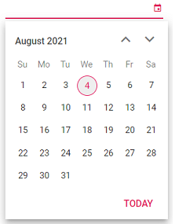
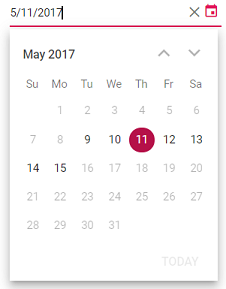

# Getting Started

This section explains how to use Syncfusion Vue DatePicker components in Vue 3 application.

## Prerequisites

* `vue` : `3+`
* `node` : `10.15+`
* `vue-class-component` : `8.0.0-rc.1`

## Creating Vue application using Vue CLI

The easiest way to create a Vue application is to use the [`Vue CLI`](https://github.com/vuejs/vue-cli). Vue CLI versions above [`4.5.0`](https://v3.vuejs.org/guide/migration/introduction.html#vue-cli) are mandatory for creating applications using Vue 3. Use the following command to uninstall older versions of the Vue CLI.

```bash
npm uninstall vue-cli -g
```

Use the following commands to install the latest version of Vue CLI.

```bash
npm install -g @vue/cli
npm install -g @vue/cli-init
```

Create a new project using the command below.

```bash
vue create quickstart
```

Initiating a new project prompts us to choose the type of project to be used for the current application. Select the option `Default (Vue 3 Preview)` from the menu.


## Adding Syncfusion DatePicker package in the application

 Syncfusion Vue packages are maintained in the [`npmjs.com`](https://www.npmjs.com/~syncfusionorg) registry.
The DatePicker component will be used in this example. To install it use the following command.

```bash
npm install @syncfusion/ej2-vue-calendars --save
```

## Adding CSS reference for Syncfusion Vue DatePicker component

Import the needed css styles for the DatePicker component along with dependency styles in the `<script>` section of the `src/App.vue` file as follows.

```html
<style>
@import '../../node_modules/@syncfusion/ej2-base/styles/material.css';
@import '../../node_modules/@syncfusion/ej2-buttons/styles/material.css';
@import '../../node_modules/@syncfusion/ej2-inputs/styles/material.css';
@import '../../node_modules/@syncfusion/ej2-popups/styles/material.css';
@import "../../node_modules/@syncfusion/ej2-vue-calendars/styles/material.css";
</style>
```

## Adding Syncfusion Vue DatePicker component in the application

You have completed all the necessary configurations needed for rendering the Syncfusion Vue component. Now, you are going to add the DatePicker component using following steps.

Import the DatePicker component in the `<script>` section of the `src/App.vue` file.

```html
<script>
import { DatePickerComponent } from "@syncfusion/ej2-vue-calendars";
</script>
```

Register the DatePicker component.

 ```js
import { DatePickerComponent } from "@syncfusion/ej2-vue-calendars";
//Component registeration
export default {
    name: "App",
    components: {
        'ejs-datepicker' : DatePickerComponent,
    }
}
```

Add the component definition in template section.

```html
<template>
    <div class="control_wrapper">
        <ejs-datepicker></ejs-datepicker>
    </div>
</template>
```

Summarizing the above steps, update the `src/App.vue` file with following code.

```html
<template>
    <div class="control_wrapper">
        <ejs-datepicker></ejs-datepicker>
    </div>
</template>
<script>
import { DatePickerComponent } from "@syncfusion/ej2-vue-calendars";
//Component registeration
export default {
    name: 'App',
    components: {
        "ejs-datepicker": DatePickerComponent
    },
}
</script>
```

## Running the application

Run the application using the following command.

```bash
npm run serve
```

Output be like the below.



## Setting the value, min and max dates

The following example demonstrates how to set the value, min and max dates on initializing the
DatePicker. Here you can able to select a date within a range from 9th to 15th in a month of May 2017. To know more about range restriction in DatePicker, please refer this [page](./date-range).

```html
<template>
    <div id="app">
        <div class='wrapper'>
            <ejs-datepicker :min="minDate" :max="maxDate" :value="dateVal" ></ejs-datepicker>
        </div>
  </div>
</template>
<script>
import { DatePickerComponent } from "@syncfusion/ej2-vue-calendars";
//Component registeration
export default {
    name: 'App',
    components: {
        "ejs-datepicker": DatePickerComponent
    },
    data () {
        return {
            minDate : new Date("05/09/2017"),
            maxDate : new Date("05/15/2017"),
            dateVal : new Date("05/11/2017")
        }
    }
}
</script>
<style>
  @import '../../node_modules/@syncfusion/ej2-base/styles/material.css';
  @import '../../node_modules/@syncfusion/ej2-buttons/styles/material.css';
  @import '../../node_modules/@syncfusion/ej2-inputs/styles/material.css';
  @import '../../node_modules/@syncfusion/ej2-popups/styles/material.css';
  @import "../../node_modules/@syncfusion/ej2-vue-calendars/styles/material.css";
  .wrapper {
    max-width: 250px;
    margin: 0 auto;
  }
</style>
```

Output be like the below.



## See Also

* [Change the format of selected date](./date-format)
* [Render DatePicker with specific culture](./globalization)
* [How to achieve validation with DatePicker](./how-to/client-side-validation)