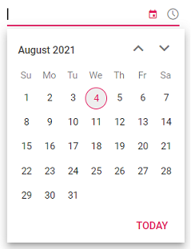
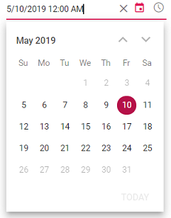

# Getting Started

This section explains how to use Syncfusion Vue DateTimePicker components in Vue 3 application.

## Prerequisites

* `vue` : `3+`
* `node` : `10.15+`
* `vue-class-component` : `8.0.0-rc.1`

## Creating Vue application using Vue CLI

The easiest way to create a Vue application is to use the [`Vue CLI`](https://github.com/vuejs/vue-cli). Vue CLI versions above [`4.5.0`](https://v3.vuejs.org/guide/migration/introduction.html#vue-cli) are mandatory for creating applications using Vue 3. Use the following command to uninstall older versions of the Vue CLI.

```bash
npm uninstall vue-cli -g
```

Use the following commands to install the latest version of Vue CLI.

```bash
npm install -g @vue/cli
npm install -g @vue/cli-init
```

Create a new project using the command below.

```bash
vue create quickstart
```

Initiating a new project prompts us to choose the type of project to be used for the current application. Select the option `Default (Vue 3 Preview)` from the menu.


## Adding Syncfusion DateTimePicker package in the application

 Syncfusion Vue packages are maintained in the [`npmjs.com`](https://www.npmjs.com/~syncfusionorg) registry.
The DateTimePicker component will be used in this example. To install it use the following command.

```bash
npm install @syncfusion/ej2-vue-calendars --save
```

## Adding CSS reference for Syncfusion Vue DateTimePicker component

Import the needed css styles for the DateTimePicker component along with dependency styles in the `<script>` section of the `src/App.vue` file as follows.

```html
<style>
@import '../../node_modules/@syncfusion/ej2-base/styles/material.css';
@import '../../node_modules/@syncfusion/ej2-buttons/styles/material.css';
@import '../../node_modules/@syncfusion/ej2-inputs/styles/material.css';
@import '../../node_modules/@syncfusion/ej2-popups/styles/material.css';
@import '../../node_modules/@syncfusion/ej2-lists/styles/material.css';
@import "../../node_modules/@syncfusion/ej2-vue-calendars/styles/material.css";
</style>
```

## Adding Syncfusion Vue DateTimePicker component in the application

You have completed all the necessary configurations needed for rendering the Syncfusion Vue component. Now, you are going to add the DateTimePicker component using following steps.

Import the DateTimePicker component in the `<script>` section of the `src/App.vue` file.

```html
<script>
import { DateTimePickerComponent } from "@syncfusion/ej2-vue-calendars";
</script>
```

Register the DateTimePicker component.

 ```js
import { DateTimePickerComponent } from "@syncfusion/ej2-vue-calendars";
//Component registeration
export default {
    name: "App",
    components: {
        'ejs-datetimepicker' : DateTimePickerComponent,
    }
}
```

Add the component definition in template section.

```html
<template>
    <div class="control_wrapper">
        <ejs-datetimepicker></ejs-datetimepicker>
    </div>
</template>
```

Summarizing the above steps, update the `src/App.vue` file with following code.

```html
<template>
    <div class="control_wrapper">
        <ejs-datetimepicker></ejs-datetimepicker>
    </div>
</template>
<script>
import { DateTimePickerComponent } from "@syncfusion/ej2-vue-calendars";
//Component registeration
export default {
    name: 'App',
    components: {
        "ejs-datetimepicker": DateTimePickerComponent
    },
}
</script>
```

## Running the application

Run the application using the following command.

```bash
npm run serve
```

Output be like the below.



## Setting the value,min and max

The minimum and maximum date time can be defined with the help of `min` and `max` property.
The following example demonstrates to set the `min` and `max` on initializing the
DateTimePicker. To know more about range restriction in DateTimePicker, please refer this [page](./date-time-range).

```html
<template>
  <div id="app">
    <div class='wrapper'>
        <ejs-datetimepicker :placeholder="waterMark" :min="minDate" :max="maxDate"  :value="val"></ejs-datetimepicker>
    </div>
  </div>
</template>
<script>
import { DateTimePickerComponent } from "@syncfusion/ej2-vue-calendars";
//Component registeration
export default {
    name: 'App',
    components: {
        "ejs-datetimepicker": DateTimePickerComponent
    },
    data () {
        return {
            waterMark : 'Select a datetime',
            minDate : new Date('5/5/2019 2:00 AM'),
            maxDate : new Date('5/25/2019 2:00 AM'),
            val : new Date('5/10/2019 12:00 AM')
        }
    }
}
</script>
<style>
@import '../../node_modules/@syncfusion/ej2-base/styles/material.css';
@import '../../node_modules/@syncfusion/ej2-buttons/styles/material.css';
@import '../../node_modules/@syncfusion/ej2-inputs/styles/material.css';
@import '../../node_modules/@syncfusion/ej2-popups/styles/material.css';
@import '../../node_modules/@syncfusion/ej2-lists/styles/material.css';
@import "../../node_modules/@syncfusion/ej2-vue-calendars/styles/material.css";
   .wrapper {
    max-width: 250px;
    margin: 0 auto;
  }
</style>
```

Output be like the below.



> If the value of `min` or `max` properties
changed through code behind, then you have to
update the `value` property to set within the
range.

## See Also

* [Render DateTimePicker with specific culture](./globalization)
