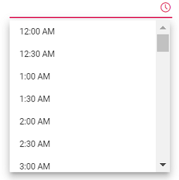
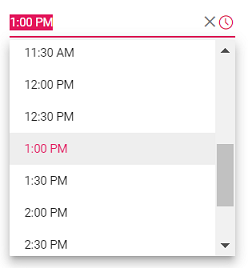

# Getting Started

This section explains how to use Syncfusion Vue TimePicker components in Vue 3 application.

## Prerequisites

* `vue` : `3+`
* `node` : `10.15+`
* `vue-class-component` : `8.0.0-rc.1`

## Creating Vue application using Vue CLI

The easiest way to create a Vue application is to use the [`Vue CLI`](https://github.com/vuejs/vue-cli). Vue CLI versions above [`4.5.0`](https://v3.vuejs.org/guide/migration/introduction.html#vue-cli) are mandatory for creating applications using Vue 3. Use the following command to uninstall older versions of the Vue CLI.

```bash
npm uninstall vue-cli -g
```

Use the following commands to install the latest version of Vue CLI.

```bash
npm install -g @vue/cli
npm install -g @vue/cli-init
```

Create a new project using the command below.

```bash
vue create quickstart
```

Initiating a new project prompts us to choose the type of project to be used for the current application. Select the option `Default (Vue 3 Preview)` from the menu.


## Adding Syncfusion TimePicker package in the application

 Syncfusion Vue packages are maintained in the [`npmjs.com`](https://www.npmjs.com/~syncfusionorg) registry.
The TimePicker component will be used in this example. To install it use the following command.

```bash
npm install @syncfusion/ej2-vue-calendars --save
```

## Adding CSS reference for Syncfusion Vue TimePicker component

Import the needed css styles for the TimePicker component along with dependency styles in the `<script>` section of the `src/App.vue` file as follows.

```html
<style>
@import '../../node_modules/@syncfusion/ej2-base/styles/material.css';
@import '../../node_modules/@syncfusion/ej2-inputs/styles/material.css';
@import '../../node_modules/@syncfusion/ej2-popups/styles/material.css';
@import '../../node_modules/@syncfusion/ej2-lists/styles/material.css';
@import "../../node_modules/@syncfusion/ej2-vue-calendars/styles/material.css";
</style>
```

## Adding Syncfusion Vue TimePicker component in the application

You have completed all the necessary configurations needed for rendering the Syncfusion Vue component. Now, you are going to add the TimePicker component using following steps.

Import the TimePicker component in the `<script>` section of the `src/App.vue` file.

```html
<script>
import { TimePickerComponent } from "@syncfusion/ej2-vue-calendars";
</script>
```

Register the TimePicker component.

 ```js
import { TimePickerComponent } from "@syncfusion/ej2-vue-calendars";
//Component registeration
export default {
    name: "App",
    components: {
        'ejs-timepicker' : TimePickerComponent,
    }
}
```

Add the component definition in template section.

```html
<template>
    <div class="control_wrapper">
        <ejs-timepicker></ejs-timepicker>
    </div>
</template>
```

Summarizing the above steps, update the `src/App.vue` file with following code.

```html
<template>
    <div class="control_wrapper">
        <ejs-timepicker></ejs-timepicker>
    </div>
</template>
<script>
import { TimePickerComponent } from "@syncfusion/ej2-vue-calendars";
//Component registeration
export default {
    name: 'App',
    components: {
        "ejs-timepicker": TimePickerComponent
    },
}
</script>
```

## Running the application

Run the application using the following command.

```bash
npm run serve
```

Output be like the below.



## Setting the value, min, and max time

The following example demonstrates how to set the value, min, and max time on initializing
 the TimePicker. The TimePicker allows you to select the time value within a range from `7:00 AM` to `4:00 PM`.

```html
<template>
  <div id="app">
    <div class='wrapper'>
      <ejs-timepicker :min="minDate" :max="maxDate" :value="timeVal"></ejs-timepicker>
    </div>
  </div>
</template>
<script>
import { TimePickerComponent } from "@syncfusion/ej2-vue-calendars";
//Component registeration
export default {
    name: 'App',
    components: {
        "ejs-timepicker": TimePickerComponent
    },
    data () {
        return {
            minDate : new Date("05/07/2017 7:00 AM"),
            maxDate : new Date("05/07/2017 4:00 PM"),
            timeVal : new Date("05/27/2017 1:00 PM")
        }
    }
}
</script>
<style>
@import '../../node_modules/@syncfusion/ej2-base/styles/material.css';
@import '../../node_modules/@syncfusion/ej2-inputs/styles/material.css';
@import '../../node_modules/@syncfusion/ej2-popups/styles/material.css';
@import '../../node_modules/@syncfusion/ej2-lists/styles/material.css';
@import "../../node_modules/@syncfusion/ej2-vue-calendars/styles/material.css";
   .wrapper {
    max-width: 250px;
    margin: 0 auto;
  }
</style>
```

Output be like the below.



## Setting the time format

Time formats is a way of representing the time value in different string format in textbox and popup
list. By default, the TimePicker's format is based on the culture. You can also customize the format by using the
[`format`](../api/timepicker#format)
property. To know more about the time format standards, refer to the
[Date and Time Format](../common/internationalization#custom-formats) section.

The following example demonstrates the TimePicker component in 24 hours format with 60 minutes
interval. The time interval is set to
60 minutes by using the [`step`](../api/timepicker#step-number) property.

```html
<template>
    <div id="app">
        <div class='wrapper'>
            <ejs-timepicker :step="timeStep" :format="timeFormat" :value="timeVal"></ejs-timepicker>
     </div>
  </div>
</template>
<script>
import { TimePickerComponent } from "@syncfusion/ej2-vue-calendars";
//Component registeration
export default {
    name: 'App',
    components: {
        "ejs-timepicker": TimePickerComponent
    },
    data () {
        return {
            timeStep : 60,
            timeFormat : 'HH:mm',
            timeVal : new Date()
        }
    }
}
</script>
<style>
@import '../../node_modules/@syncfusion/ej2-base/styles/material.css';
@import '../../node_modules/@syncfusion/ej2-inputs/styles/material.css';
@import '../../node_modules/@syncfusion/ej2-popups/styles/material.css';
@import '../../node_modules/@syncfusion/ej2-lists/styles/material.css';
@import "../../node_modules/@syncfusion/ej2-vue-calendars/styles/material.css";
   .wrapper {
    max-width: 250px;
    margin: 0 auto;
  }
</style>
```

Output be like the below.


> Once the time format property is defined, it will be applicable to all the cultures.

## See Also

* [Render TimePicker with min and max time](./time-range)
* [How to achieve validation with TimePicker](./how-to/client-side-validation-using-form-validator)
* [Render TimePicker with specific culture](./globalization)