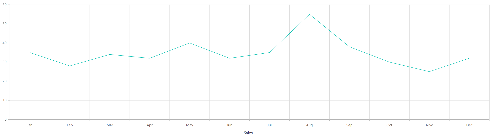

# Getting Started with Syncfusion Chart component in Vue 3

This section explains how to use Chart component in Vue 3 application.

## Prerequisites

* `vue` : `3+`
* `node` : `10.15+`
* `vue-class-component` : `8.0.0-rc.1`

## Creating Vue application using Vue CLI

The easiest way to create a Vue application is to use the [`Vue CLI`](https://github.com/vuejs/vue-cli). Vue CLI versions above [`4.5.0`](https://v3.vuejs.org/guide/migration/introduction.html#vue-cli) are mandatory for creating applications using Vue 3. Use the following command to uninstall older versions of the Vue CLI.

```bash
npm uninstall vue-cli -g
```

Use the following commands to install the latest version of Vue CLI.

```bash
npm install -g @vue/cli
npm install -g @vue/cli-init
```

Create a new project using the command below.

```bash
vue create quickstart

```

Initiating a new project prompts us to choose the type of project to be used for the current application. Select the option `Default (Vue 3 Preview)` from the menu.


## Adding Syncfusion Chart package in the application

Syncfusion Vue packages are maintained in the [`npmjs.com`](https://www.npmjs.com/~syncfusionorg) registry. The Chart component will be used in this example. To install it in the **quickstart** folder use the following command.

```bash
npm install @syncfusion/ej2-vue-charts --save
```

## Adding Syncfusion Chart component in the application

You have completed all the necessary configurations needed for rendering the Syncfusion Vue component. Now, you are going to add the Chart component using following steps.

**1.** Import the Chart component in the `<script>` section of the `src/App.vue` file.

```html
<script>
import { ChartComponent, SeriesCollectionDirective, SeriesDirective, LineSeries, Legend, Category } from "@syncfusion/ej2-vue-charts";
</script>
```

**2.** Register the Chart component along with the required child directives which are used in this example. Find the list of child directives and the tag names that can be used in the Chart component in the following table.
  
| Directive Name              | Tag Name              |
|-----------------------------|-----------------------|
| `SeriesCollectionDirective` | `e-series-collection` |
| `SeriesDirective`           | `e-series`            |

```js
import { ChartComponent, SeriesCollectionDirective, SeriesDirective, LineSeries, Legend, Category } from "@syncfusion/ej2-vue-charts";
//Component registeration.
export default {
  name: "App",
  components: {
    'ejs-chart' : ChartComponent,
    'e-series-collection' : SeriesCollectionDirective,
    'e-series' : SeriesDirective
  },
};

```

In the above code snippet, you have registered Chart and the directives for series. Series directives are used to visualize the data with different chart types like `Line`, `Column`, `Bar` etc.

**3.** Add the component definition in template section.

```html
<template>
    <ejs-chart id="container" :title='title' :primaryXAxis='primaryXAxis'>
        <e-series-collection>
            <e-series :dataSource='seriesData' type='Line' xName='month' yName='sales' name='Sales'> </e-series>
        </e-series-collection>
    </ejs-chart>
</template>

```

Above is the Chart component with `dataSource` bound to series directives.

**4.** Define the collection `seriesData` which is bound for the `dataSource` and `primaryXAxis` properties in the `script` section.

```js
  data() {
    return {
      primaryXAxis: {
        valueType: 'Category'
      },
      seriesData: [
        { month: 'Jan', sales: 35 }, { month: 'Feb', sales: 28 },
        { month: 'Mar', sales: 34 }, { month: 'Apr', sales: 32 },
        { month: 'May', sales: 40 }, { month: 'Jun', sales: 32 },
        { month: 'Jul', sales: 35 }, { month: 'Aug', sales: 55 },
        { month: 'Sep', sales: 38 }, { month: 'Oct', sales: 30 },
        { month: 'Nov', sales: 25 }, { month: 'Dec', sales: 32 }
      ],
    };
  },

```

**5.** Summarizing the above steps, update the `src/App.vue` file with following code.

```html
<template>
    <ejs-chart id="container" :title='title' :primaryXAxis='primaryXAxis'>
        <e-series-collection>
            <e-series :dataSource='seriesData' type='Line' xName='month' yName='sales' name='Sales'> </e-series>
        </e-series-collection>
    </ejs-chart>
</template>

<script>
import { ChartComponent, SeriesCollectionDirective, SeriesDirective, LineSeries, Legend, Category } from "@syncfusion/ej2-vue-charts";

export default {
  name: "App",
  components: {
    'ejs-chart' : ChartComponent,
    'e-series-collection' : SeriesCollectionDirective,
    'e-series' : SeriesDirective
  },
  data() {
    return {
      primaryXAxis: {
        valueType: 'Category'
      },
      seriesData: [
        { month: 'Jan', sales: 35 }, { month: 'Feb', sales: 28 },
        { month: 'Mar', sales: 34 }, { month: 'Apr', sales: 32 },
        { month: 'May', sales: 40 }, { month: 'Jun', sales: 32 },
        { month: 'Jul', sales: 35 }, { month: 'Aug', sales: 55 },
        { month: 'Sep', sales: 38 }, { month: 'Oct', sales: 30 },
        { month: 'Nov', sales: 25 }, { month: 'Dec', sales: 32 }
      ],
    };
  },
  provide: {
    chart: [ LineSeries, Legend, Category ]
  },
};
</script>

```

**6.** Run the application using the following command.

```bash
npm run serve
```

The web server will be initiated and open the **quickstart** app in the browser at port [`localhost:8080`](http://localhost:8080/).



Refer the following sample, [vue3-charts-getting-started](https://github.com/SyncfusionExamples/vue3-chart-getting-started).
