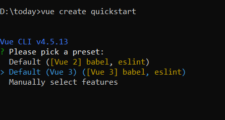
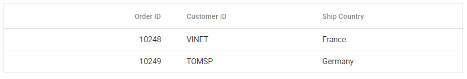

# Getting Started with Syncfusion Vue UI Components in Vue 3

This section explains how to use Syncfusion Vue components in Vue 3 application.

## Prerequisites

* `vue` : 3+
* `node` : 10.15+
* `vue-class-component` : 8.0.0-rc.1

## Creating Vue application using Vue CLI

The easiest way to create a Vue application is to use the [`Vue CLI`](https://github.com/vuejs/vue-cli).Vue CLI versions above [`4.5.0`](https://v3.vuejs.org/guide/migration/introduction.html#vue-cli) is mandatory for creating applications using Vue 3.We can use the following command to uninstall older versions of the Vue CLI if we already have them.

```bash
npm uninstall vue-cli -g
```

Use the following commands to install the latest version of Vue CLI.

```bash
npm install -g @vue/cli
npm install -g @vue/cli-init
```

Create a new project using the command below.

```bash
vue create quickstart
```

Initiating a new project prompts us to choose the type of project we want to use for the application. Select the option `Default (Vue 3 Preview)` from the menu.



## Adding Syncfusion packages in the application

 Syncfusion Vue packages are maintained in the [`npmjs.com`](https://www.npmjs.com/~syncfusionorg) registry.
We'll use the Grid component for this example. To install it use the following command.

```bash
npm install @syncfusion/ej2-vue-grids --save
```

## Adding CSS reference for Syncfusion Vue components

Import the needed css styles for the  Grid component along with dependency styles in the `<script>` section of the `src/App.vue` file as follows.

```js
<script>
import "../node_modules/@syncfusion/ej2-base/styles/material.css";
import "../node_modules/@syncfusion/ej2-buttons/styles/material.css";
import "../node_modules/@syncfusion/ej2-calendars/styles/material.css";
import "../node_modules/@syncfusion/ej2-dropdowns/styles/material.css";
import "../node_modules/@syncfusion/ej2-inputs/styles/material.css";
import "../node_modules/@syncfusion/ej2-navigations/styles/material.css";
import "../node_modules/@syncfusion/ej2-popups/styles/material.css";
import "../node_modules/@syncfusion/ej2-splitbuttons/styles/material.css";
import "../node_modules/@syncfusion/ej2-vue-grids/styles/material.css";
</script>
```

Note: Grid components uses other Syncfusion components too, so we need to add other component's css references to use all the Grid functionalities.

## Adding Syncfusion Vue component in the application.

We have completed all the necessary configurations needed  for rendering the Syncfusion Vue component. Now, we are going to add the Grid component using following steps.

  1. Import the Grid component in the `<script>` section of the `src/App.vue` file.

   ```html
   <script>
   import { GridComponent, ColumnsDirective, ColumnDirective } from '@syncfusion/ej2-vue-grids';
   </script>
   ```
   
  2. Register the Grid component along with the required child directives which are used in this example.

```js
import { GridComponent, ColumnsDirective, ColumnDirective } from '@syncfusion/ej2-vue-grids';
  //Component registeration
export default {
    name: "App",
    components: {
      'ejs-grid' : GridComponent,
      'e-columns' : ColumnsDirective,
      'e-column' : ColumnDirective
    }
}
``` 

  In the above code snippet, we have registered Grid and the column directives. Column directives are used to define the column definition for the Grid component.

  3. Add the component definition in template section.
  
   ```html
 <template>
     <ejs-grid :dataSource='data'>
         <e-columns>
             <e-column field='OrderID' headerText='Order ID' textAlign='Right'  width=100></e-column>
             <e-column field='CustomerID' headerText='Customer ID' width=120></e-column>
             <e-column field='ShipCountry' headerText='Ship Country' width=150></e-column>
         </e-columns>
     </ejs-grid>
 </template>
   ```

  Above is the Grid component definition, with `dataSource` property binding and columns definitions.

  4. Declare the bound properties in the `script` section. Declare the collection `data` which is bound for the `dataSource` property.

```js
data() {
  return {
    data:  [
      {
         "OrderID":10248,
         "CustomerID":"VINET",
         "ShipCountry":"France"
      },
      {
         "OrderID":10249,
          "CustomerID":"TOMSP",
          "ShipCountry":"Germany"
      }]
    };
}
```

  5. Summarizing the above steps, update the `src/App.vue` file with following code.

```html
<template>
  <ejs-grid :dataSource="data">
    <e-columns>
      <e-column field="OrderID" headerText="Order ID" textAlign="Right" :isPrimaryKey="true" width="100"></e-column>
      <e-column field="CustomerID" headerText="Customer ID"  width="80"></e-column>
      <e-column field="ShipCountry" headerText="Ship Country" width="90"></e-column>
    </e-columns>
  </ejs-grid>
</template>
<script>
import { GridComponent, ColumnsDirective, ColumnDirective} from "@syncfusion/ej2-vue-grids";
import "../node_modules/@syncfusion/ej2-base/styles/material.css";
import "../node_modules/@syncfusion/ej2-buttons/styles/material.css";
import "../node_modules/@syncfusion/ej2-calendars/styles/material.css";
import "../node_modules/@syncfusion/ej2-dropdowns/styles/material.css";
import "../node_modules/@syncfusion/ej2-inputs/styles/material.css";
import "../node_modules/@syncfusion/ej2-navigations/styles/material.css";
import "../node_modules/@syncfusion/ej2-popups/styles/material.css";
import "../node_modules/@syncfusion/ej2-splitbuttons/styles/material.css";
import "../node_modules/@syncfusion/ej2-vue-grids/styles/material.css";

export default {
  name: "App",
  // Declaring component and its directives
    components: {
      "ejs-grid": GridComponent,
      "e-columns": ColumnsDirective,
      "e-column": ColumnDirective,
    },
  // Bound properties declarations
  data() {
    return {
      data: [
        {
          OrderID: 10248,
          CustomerID: "VINET",
          ShipCountry: "France",
        },
        {
          OrderID: 10249,
          CustomerID: "TOMSP",
          ShipCountry: "Germany",
        },
      ],
    };
  },
};
</script>

```

## Running the application

Run the application using the following command.

```bash
npm run serve
```

Web server will be intiated, Open the quick start app in the browser at port [`localhost:8080`](http://localhost:8080/).




## Migration from Vue 2 to Vue 3

### Registering Vue component

It is required to register the component and any child directives used within the component separately in Vue 3.The differnce in registering components in Vue 2 and Vue 3 can be found below.

* Component registration in Vue 2

```html
import * as Vue from 'vue';
import { GridPlugin } from '@syncfuion/ej2-vue-grids';
// Registering of component and directives as single plugin.
Vue.use(ButtonPlugin);
```

* Component registration in Vue 3

```js
import { GridComponent, ColumnsDirective, ColumnDirective } from '@syncfusion/ej2-vue-grids';
  //Component registration
export default {
    name: "App",
    components: {
      'ejs-grid' : GridComponent,
      'e-columns' : ColumnsDirective,
      'e-column' : ColumnDirective
    }
```

In the above code `ejs-grid` denotes the Grid component tag.`e-columns` and `e-column` denotes the child column directives tag which is used for Column definition declaration.

Note: Registering the child directives is not needed if we don't use them.

### Template Usage:

Before using the template in the Vue application, we need to enable the [runtime compiler](https://vuejs.org/v2/guide/installation.html#Runtime-Compiler-vs-Runtime-only). Create the `Vue.config.js` file in the root folder if it doens  not exists and add the following code

```js
module.exports = {
    runtimeCompiler: true
  }
```

Due to changes in the [Vue 3 API](https://v3.vuejs.org/guide/migration/global-api.html#a-new-global-api-createapp), the registration of templates in Vue 3 is different from Vue 2.

|    Vue 2                                             |    Vue 3      |
|:--------------------------------------------------------:|:-------------------:|
|    declare templates using `Vue.component` module. |    Use  the `createapp` method from Vue to declare templates.|


In template declaration, the component name must match the property binding name.In the following example, the Grid column `template` property is assigned with the name `colTemplate`.

```html
<template>
  <ejs-grid ref='grid' :dataSource="data" height=310 >
    <e-columns>
      <e-column headerText='Employee Name' width='150' textAlign='Center' :template='colTemplate'></e-column>
      <e-column field='EmployeeID' width='125' textAlign='Right'></e-column>
    </e-columns>
  </ejs-grid>
<template>

<script>
import { GridComponent, ColumnsDirective, ColumnDirective} from "@syncfusion/ej2-vue-grids";
import { createApp } from "vue";
import "../node_modules/@syncfusion/ej2-base/styles/material.css";
import "../node_modules/@syncfusion/ej2-buttons/styles/material.css";
import "../node_modules/@syncfusion/ej2-calendars/styles/material.css";
import "../node_modules/@syncfusion/ej2-dropdowns/styles/material.css";
import "../node_modules/@syncfusion/ej2-inputs/styles/material.css";
import "../node_modules/@syncfusion/ej2-navigations/styles/material.css";
import "../node_modules/@syncfusion/ej2-popups/styles/material.css";
import "../node_modules/@syncfusion/ej2-splitbuttons/styles/material.css";
import "../node_modules/@syncfusion/ej2-vue-grids/styles/material.css";

const app = createApp();

// Template declaration
var colVue = app.component('colTemplate', {
  data: () => ({}),
  template:`<b>Name:{{data.EmployeeID}}</b>`});

export default {
  data() {
    return {
      data:  [
        {
          EmployeeID: 10248,
          Employee Name: "VINET"
        },
        {
          EmployeeID: 10249,
          Employee Name: "TOMSP"
        },
      ],
      colTemplate: function() {
        return { template: colVue };
      }
    };
  }
};

</script>
```

### Using Syncfusion Vue components inside template properties

To use other Syncfusion Vue components inside the templates, we need to register the components in the template declaration also.

In the following sample, we are using the Button component inside the grid component's template property. To use the Button component within the template we need to register button component in template declaration.

```html
<template>
  <ejs-grid ref='grid' :dataSource="data">
    <e-columns>
      <e-column headerText='EmployeeName' width='150' textAlign='Center' :template='colTemplate'></e-column>
      <e-column field='EmployeeID' width='125' textAlign='Right'></e-column>
    </e-columns>
</ejs-grid>
</template>

<script>
import { ButtonComponent } from "@syncfusion/ej2-vue-buttons";
import {GridComponent, ColumnsDirective,ColumnDirective } from "@syncfusion/ej2-vue-grids";
import { createApp } from "vue";
import "../node_modules/@syncfusion/ej2-base/styles/material.css";
import "../node_modules/@syncfusion/ej2-buttons/styles/material.css";
import "../node_modules/@syncfusion/ej2-calendars/styles/material.css";
import "../node_modules/@syncfusion/ej2-dropdowns/styles/material.css";
import "../node_modules/@syncfusion/ej2-inputs/styles/material.css";
import "../node_modules/@syncfusion/ej2-navigations/styles/material.css";
import "../node_modules/@syncfusion/ej2-popups/styles/material.css";
import "../node_modules/@syncfusion/ej2-splitbuttons/styles/material.css";
import "../node_modules/@syncfusion/ej2-vue-grids/styles/material.css";
const app = createApp();

// Template declaration
var colVue = app.component('colTemplate', {
  data: () => ({}),
  template: `
  <ejs-Button cssClass="e-primary">{{data.EmployeeName}}</ejs-Button>`,
  // Declaring component which is used inside template property
  components: {
    "ejs-Button" : ButtonComponent
  }
});

export default {
  name: 'Vue3-App',
  components: {
    "ejs-grid": GridComponent,
    "e-columns": ColumnsDirective,
    "e-column": ColumnDirective,
  },
  data() {
    return {
      data: [
        {
          EmployeeID: 10248,
          EmployeeName: "VINET"
        },
        {
          EmployeeID: 10249,
          EmployeeName: "TOMSP"
        },
      ],
      colTemplate: function() {
        return { template: colVue };
      }
    };
  }
};

</script>
```
