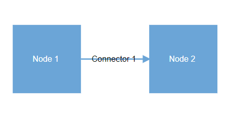
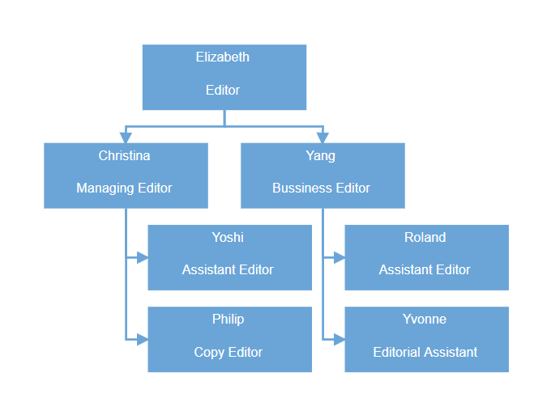

# Getting Started with Syncfusion Diagram Component in Vue 3

This section explains how to use Diagram component in Vue 3 application.

## Prerequisites

* `vue` : `3+`
* `node` : `10.15+`
* `vue-class-component` : `8.0.0-rc.1`

## Creating Vue application using Vue CLI

The easiest way to create a Vue application is to use the [`Vue CLI`](https://github.com/vuejs/vue-cli). Vue CLI versions higher than [`4.5.0`](https://v3.vuejs.org/guide/migration/introduction.html#vue-cli) are mandatory for creating applications using Vue 3. Use the following command to uninstall older versions of the Vue CLI.

```bash
npm uninstall vue-cli -g
```

Use the following commands to install the latest version of Vue CLI.

```bash
npm install -g @vue/cli
npm install -g @vue/cli-init
```

Create a new project using the following command.

```bash
vue create quickstart

```

Initiating a new project prompts us to select the type of project to be used for the current application. Select the option `Default (Vue 3 Preview)` from the menu.


## Adding Syncfusion Diagram package in the application

Syncfusion Vue packages are maintained in the [`npmjs.com`](https://www.npmjs.com/~syncfusionorg) registry.
In this example, the Diagram component will be used. Use the following command to install it.

```bash
npm install @syncfusion/ej2-vue-diagrams --save
npm install @syncfusion/ej2-vue-dropdowns --save
```

## Adding CSS reference for Syncfusion Vue Diagram component

Import the necessary css styles for the Diagram component along with dependency styles in the `<script>` section of the `src/App.vue` file as follows.

```js
<script>
import "../node_modules/@syncfusion/ej2-base/styles/material.css";
import "../node_modules/@syncfusion/ej2-navigations/styles/material.css";
import "../node_modules/@syncfusion/ej2-buttons/styles/material.css";
import "../node_modules/@syncfusion/ej2-dropdowns/styles/material.css";
import "../node_modules/@syncfusion/ej2-inputs/styles/material.css";
import "../node_modules/@syncfusion/ej2-lists/styles/material.css";
import "../node_modules/@syncfusion/ej2-popups/styles/material.css";
import "../node_modules/@syncfusion/ej2-splitbuttons/styles/material.css";
import "../node_modules/@syncfusion/ej2-vue-diagrams/styles/material.css";
</script>
```

Note: Diagram component makes use of other Syncfusion components too, the dependent components' CSS references need to be added for using all the Diagram functionalities.

## Adding Syncfusion Vue Diagram component in the application

You have completed all of the necessary configurations required to render the Syncfusion Vue component. Now, you are going to add the Diagram component using the following steps.

1. Import the Diagram component in the `<script>` section of the `src/App.vue` file.

      ```html
      <script>
    import { DiagramComponent, NodesDirective, NodeDirective, ConnectorsDirective, ConnectorDirective,NodeAnnotationsDirective, NodeAnnotationDirective, ConnectorAnnotationsDirective,ConnectorAnnotationDirective } from '@syncfusion/ej2-vue-diagrams';
      </script>

      ```

2. Register the Diagram component along with the required child directives, which are used in this example. The following table contains a list of child directives and tag names that can be used in the Diagram component.

    | Directive Name   | Tag Name    |
    |------------------|-------------|
    | `DiagramComponent` | `ejs-diagram` |
    | `NodesDirective` | `e-nodes` |
    | `NodeDirective`  | `e-node`  |
    | `ConnectorsDirective` | `e-connectors` |
    | `ConnectorDirective`  | `e-connector`  |
    | `NodeAnnotationsDirective` | `e-node-annotations` |
    | `NodeAnnotationDirective`  | `e-node-annotation`  |
    | `ConnectorAnnotationsDirective` | `e-connector-annotations` |
    | `ConnectorAnnotationDirective`  | `e-connector-annotation`  |

    ```js

    import { DiagramComponent, NodesDirective, NodeDirective, ConnectorsDirective, ConnectorDirective,NodeAnnotationsDirective, NodeAnnotationDirective, ConnectorAnnotationsDirective,ConnectorAnnotationDirective } from '@syncfusion/ej2-vue-diagrams';
    //Component registeration
    export default {
      name: "App",
      components: {
          "ejs-diagram": DiagramComponent,
          "e-nodes": NodesDirective,
          "e-node": NodeDirective,
          "e-connectors": ConnectorsDirective,
          "e-connector": ConnectorDirective,
          "e-node-annotations": NodeAnnotationsDirective,
          "e-node-annotation": NodeAnnotationDirective,
          "e-connector-annotations": ConnectorAnnotationsDirective,
          "e-connector-annotation": ConnectorAnnotationDirective
      }
    }
    ```

    In the above code sample, you have registered Diagram and the node directives. Node directives are used to define the node for the diagram component and Connector directives are used to define the connector
    for the diagram component.

3. Add the component definition in template section.

    ```html
    <template>
    <ejs-diagram id="diagram" :width="width" :height="height">
          <e-nodes>
            <e-node id="NewIdea" :offsetX="offsetX" :offsetY="offsetY">
              <e-node-annotations>
                <e-node-annotation content="Place Order"> </e-node-annotation>
              </e-node-annotations>
            </e-node>
          </e-nodes>
          <e-connectors>
            <e-connector
              id="connector1" :sourcePoint="point1" :targetPoint="point2"
            >
            <e-connector-annotations>
              <e-connector-annotation content="Connector"> </e-connector-annotation>
            </e-connector-annotations>
            </e-connector>
          </e-connectors>
          </ejs-diagram>
    </template>
    ```

    The Diagram component definition is shown above, with `width` and `height` property binding diagram width and height.

4. Declare the node and connector properties in the `script` section. Declare the `offsetX` and `offsetY` properties, which act as the position for the node. Declare the `point1` and `point2` properties, which act as the source and target points for the connector.

      ```js
    data() {
      return {
        width: "1300px",
        height: "800px",
        offsetX: 300,
        offsetY: 200,
        point1: { x: 300, y: 200 },
        point2: { x: 450, y: 300 }
        };
    }
      ```

5. Summarizing the above steps, update the `src/App.vue` file with following code.

    ```html
    <template>
        <ejs-diagram
          id="diagram"
          :width="width"
          :height="height"
          :snapSettings="snapSettings"
          :getNodeDefaults="getNodeDefaults"
          :getConnectorDefaults="getConnectorDefaults"
        >
          <e-nodes>
            <e-node id="NewIdea" :offsetX="offsetX" :offsetY="offsetY" :height="nodeHeight" :width="nodeWidth">
              <e-node-annotations>
                <e-node-annotation content="Node 1"> </e-node-annotation>
              </e-node-annotations>
            </e-node>
            <e-node id="Meeting" :offsetX="offsetX2" :offsetY="offsetY2" :height="nodeHeight" :width="nodeWidth">
              <e-node-annotations>
                <e-node-annotation content="Node 2"> </e-node-annotation>
              </e-node-annotations>
            </e-node>
          </e-nodes>
          <e-connectors>
            <e-connector
              id="connector2" sourceID="NewIdea" targetID="Meeting">
            <e-connector-annotations>
              <e-connector-annotation content="Connector 1"> </e-connector-annotation>
            </e-connector-annotations>
            </e-connector>
          </e-connectors>
        </ejs-diagram>
    </template>

    <script>
    import {
      ConnectorDirective,
      ConnectorsDirective,
      NodesDirective,
      NodeDirective,
      SnapConstraints,
      NodeAnnotationsDirective,
      NodeAnnotationDirective,
      DiagramComponent,
      ConnectorAnnotationsDirective,
      ConnectorAnnotationDirective,
    } from "@syncfusion/ej2-vue-diagrams";

    export default {
      name: "App",
      components: {
        "ejs-diagram": DiagramComponent,
        "e-nodes": NodesDirective,
        "e-node": NodeDirective,
        "e-node-annotations": NodeAnnotationsDirective,
        "e-node-annotation": NodeAnnotationDirective,
        "e-connectors": ConnectorsDirective,
        "e-connector": ConnectorDirective,
        "e-connector-annotations": ConnectorAnnotationsDirective,
        "e-connector-annotation": ConnectorAnnotationDirective,
      },
      data() {
        return {
          width: "1300px",
          height: "800px",
          nodeWidth: 100,
          nodeHeight: 100,
          offsetX: 200,
          offsetY: 200,
          offsetX2: 400,
          offsetY2: 200,
          snapSettings: { constraints: SnapConstraints.None },
          getNodeDefaults: (node) => {
            node.height = 100;
            node.width = 100;
            node.style = { fill: "#6BA5D7", strokeWidth: 0 };
            node.annotations[0].style.color = "white";
            return node;
          },
          getConnectorDefaults: (obj) => {
            obj.type = "Orthogonal";
            obj.annotations[0].style.color = "black";
            obj.style = {
              strokeColor: "#6BA5D7",
              fill: "#6BA5D7",
              strokeWidth: 2,
            };
            obj.targetDecorator = {
              style: {
                fill: "#6BA5D7",
                strokeColor: "#6BA5D7",
              },
            };
            return obj;
          },
        };
      },
    };
    </script>

    <style>
    @import "../node_modules/@syncfusion/ej2-base/styles/material.css";
    @import "../node_modules/@syncfusion/ej2-inputs/styles/material.css";
    @import "../node_modules/@syncfusion/ej2-vue-dropdowns/styles/material.css";
    @import "../node_modules/@syncfusion/ej2-vue-diagrams/styles/material.css";
    @import "../node_modules/@syncfusion/ej2-navigations/styles/material.css";
    </style>
    ```

## Running the application

Run the application using the following command.

```bash
npm run serve
```

Web server will be initiated, open the quick start app in the browser at port [`localhost:8080`](http://localhost:8080/).



## Automatic organization chart

In the 'Flow Diagram' section, how to create a diagram manually was discussed. This section explains how to create and position the diagram automatically.

### Business object (Employee information)

Define employee information as JSON data. The following code example shows an employee array where `Name` is used as an unique identifier and `ReportingPerson` is used to identify the person in the organization to whom an employee reports.

```html
export let localdata = [
  {
    Name: "Elizabeth",
    Role: "Editor",
  },
  {
    Name: "Christina",
    ReportingPerson: "Elizabeth",
    Role: "Managing Editor",
  },
  {
    Name: "Yoshi",
    ReportingPerson: "Christina",
    Role: "Assistant Editor",
  },
  {
    Name: "Philip",
    ReportingPerson: "Christina",
    Role: "Copy Editor",
  },
  {
    Name: "Yang",
    ReportingPerson: "Elizabeth",
    Role: "Bussiness Editor",
  },
  {
    Name: "Roland",
    ReportingPerson: "Yang",
    Role: "Assistant Editor",
  },
  {
    Name: "Yvonne",
    ReportingPerson: "Yang",
    Role: "Editorial Assistant",
  },
];

```

### Map data source

You can configure the above "Employee Information" with diagram so that the nodes and connectors are automatically generated using the mapping properties. The following code example shows how `dataSourceSettings` is used to map ID and parent with property name identifiers for employee information.

```html
<template>
<ejs-diagram id="diagram":width="width":height="height":dataSourceSettings="dataSourceSettings">
</ejs-diagram>
</template>

<script>
  data() {
    return {
      dataSourceSettings: {
        id: "Name",
        parentId: "ReportingPerson",
        dataManager: new DataManager(localdata),
        doBinding: (nodeModel, localdata) => {
          nodeModel.annotations = [
            {
              content: localdata.Name,
              offset: { x: 0.5, y: 0.2 },
              style: { color: "white" },
            },
            {
              content: localdata.Role,
              offset: { x: 0.5, y: 0.7 },
              style: { color: "white" },
            },
          ];
          nodeModel.style = { fill: "#6BA5D7", strokeWidth: 0 };
        },
      },
    }
  },

</script>
```

### Visualize employee

The following code examples indicate how to define the default appearance of nodes and connectors.

```html
<template>
<ejs-diagram id="diagram" :width="width" :height="height" :getNodeDefaults="getNodeDefaults" :getConnectorDefaults="getConnectorDefaults" :layout="layout" :dataSourceSettings="dataSourceSettings" :snapSettings="snapSettings">
  </ejs-diagram>
</template>

<script>
import {
  DiagramComponent,
  DataBinding,
  HierarchicalTree,
  SnapConstraints,
} from "@syncfusion/ej2-vue-diagrams";

import { DataManager } from "@syncfusion/ej2-data";

export let localdata = [
  {
    Name: "Elizabeth",
    Role: "Editor",
  },
  {
    Name: "Christina",
    ReportingPerson: "Elizabeth",
    Role: "Managing Editor",
  },
  {
    Name: "Yoshi",
    ReportingPerson: "Christina",
    Role: "Assistant Editor",
  },
  {
    Name: "Philip",
    ReportingPerson: "Christina",
    Role: "Copy Editor",
  },
  {
    Name: "Yang",
    ReportingPerson: "Elizabeth",
    Role: "Bussiness Editor",
  },
  {
    Name: "Roland",
    ReportingPerson: "Yang",
    Role: "Assistant Editor",
  },
  {
    Name: "Yvonne",
    ReportingPerson: "Yang",
    Role: "Editorial Assistant",
  },
];

export default {
  name: "App",
  components: {
    "ejs-diagram": DiagramComponent,
  },
  data() {
    return {
      width: "1300px",
      height: "800px",
      snapSettings: { constraints: SnapConstraints.None },
      getNodeDefaults: (node) => {
        node.height = 60;
        node.width = 150;
        return node;
      },
      getConnectorDefaults: (obj) => {
        obj.type = "Orthogonal";
        obj.style = {
          strokeColor: "#6BA5D7",
          fill: "#6BA5D7",
          strokeWidth: 2,
        };
        obj.targetDecorator = {
          style: {
            fill: "#6BA5D7",
            strokeColor: "#6BA5D7",
          },
        };
        return obj;
      },
      layout: {
        type: "OrganizationalChart",
      },
      dataSourceSettings: {
        id: "Name",
        parentId: "ReportingPerson",
        dataManager: new DataManager(localdata),
        doBinding: (nodeModel, localdata) => {
          nodeModel.annotations = [
            {
              content: localdata.Name,
              offset: { x: 0.5, y: 0.2 },
              style: { color: "white" },
            },
            {
              content: localdata.Role,
              offset: { x: 0.5, y: 0.7 },
              style: { color: "white" },
            },
          ];
          nodeModel.style = { fill: "#6BA5D7", strokeWidth: 0 };
        },
      },
    }
  },
  provide: { diagram: [DataBinding, HierarchicalTree] },
};
</script>

<style>
@import "../node_modules/@syncfusion/ej2-base/styles/material.css";
@import "../node_modules/@syncfusion/ej2-inputs/styles/material.css";
@import "../node_modules/@syncfusion/ej2-vue-dropdowns/styles/material.css";
@import "../node_modules/@syncfusion/ej2-vue-diagrams/styles/material.css";
@import "../node_modules/@syncfusion/ej2-navigations/styles/material.css";
</style>
```



Refer the following sample, [vue3-diagram-gettingstarted](https://github.com/SyncfusionExamples/vue3-diagram-getting-started)
