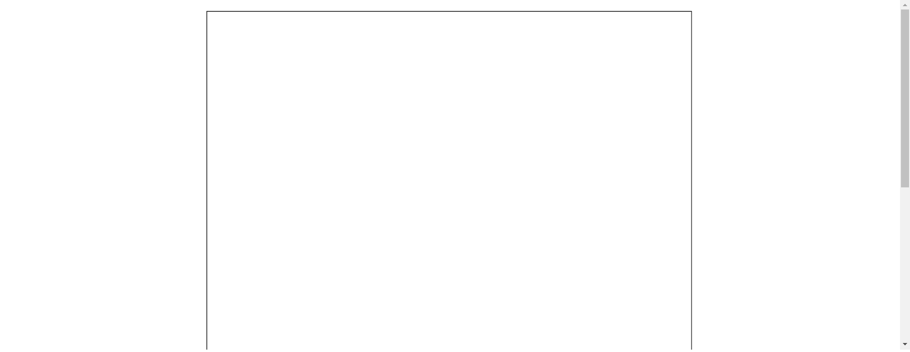
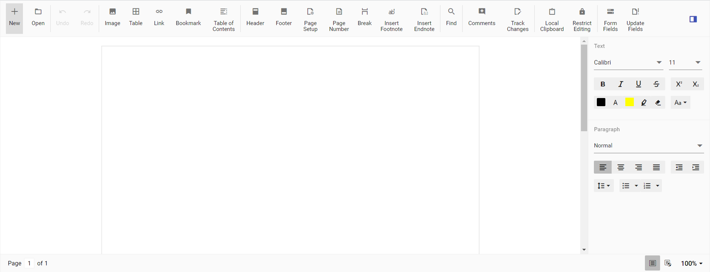

# Getting Started with Syncfusion Document Editor Component in Vue 3

This section explains how to use Document Editor component in Vue 3 application.

## Prerequisites

* `vue` : `3+`
* `node` : `10.15+`
* `vue-class-component` : `8.0.0-rc.1`

## Creating Vue application using Vue CLI

The easiest way to create a Vue application is to use the [`Vue CLI`](https://github.com/vuejs/vue-cli). Vue CLI versions above [`4.5.0`](https://v3.vuejs.org/guide/migration/introduction.html#vue-cli) are mandatory for creating applications using Vue 3. Use the following command to uninstall older versions of the Vue CLI.

```bash
npm uninstall vue-cli -g
```

Use the following commands to install the latest version of Vue CLI.

```bash
npm install -g @vue/cli
npm install -g @vue/cli-init
```

Create a new project using the command below.

```bash
vue create quickstart

```

Initiating a new project prompts us to choose the type of project to be used for the current application. Select the option `Default (Vue 3 Preview)` from the menu.


## Adding Syncfusion DocumentEditor package in the application

 Syncfusion Vue packages are maintained in the [`npmjs.com`](https://www.npmjs.com/~syncfusionorg) registry.
The Document Editor component will be used in this example. To install it use the following command.

```bash
npm install @syncfusion/ej2-vue-documenteditor --save
```

> The **--save** will instruct NPM to include the Document Editor package inside the `dependencies` section of the `package.json`.

## Adding CSS reference

Combined CSS files are available in the Essential JS 2 package root folder.
This can be referenced in your `[src/styles/styles.css]` using the following code.

```css
@import '../../node_modules/@syncfusion/ej2/material.css';
```

> To know about individual component CSS, please refer to
[Individual Component theme files](../appearance/theme#referring-individual-control-theme/) section.

## Adding Component

> Starting from `v19.3.0.x`, we have optimized the accuracy of text size measurements such as to match Microsoft Word pagination for most Word documents. This improvement is included as default behavior along with an optional API [to disable it and retain the document pagination behavior of older versions](../document-editor/how-to/disable-optimized-text-measuring).

### Adding DocumentEditor component in the application

Document Editor Component is used to create, view and edit word documents. In this, you can customize the UI options based on your requirements to modify the document.

You have completed all the necessary configurations needed for rendering the Syncfusion Vue component. Now, you are going to add the Document Editor component using following steps.

**Step 1:** Import the Document Editor component in the `<script>` section of the `src/App.vue` file.

  ```html
  <script>
        import { DocumentEditorComponent, Print, SfdtExport, WordExport, TextExport, Selection, Search, Editor, ImageResizer, EditorHistory, ContextMenu, OptionsPane, HyperlinkDialog, TableDialog, BookmarkDialog, TableOfContentsDialog, PageSetupDialog, StyleDialog, ListDialog, ParagraphDialog, BulletsAndNumberingDialog, FontDialog, TablePropertiesDialog, BordersAndShadingDialog, TableOptionsDialog, CellOptionsDialog, StylesDialog } from '@syncfusion/ej2-vue-documenteditor';
  </script>
  
  ```

**Step 2:** Register the Document Editor Container component in your application.

```js
  import { DocumentEditorComponent } from '@syncfusion/ej2-vue-documenteditor';
    //Component registeration
  export default {
      name: "App",
      components: {
        'ejs-documenteditor' : DocumentEditorComponent
      }
  }
```

  In the above code snippet, you have registered DocumentEditorContainer.

**Step 3:** Add the component definition in template section.

```html
<template>
    <ejs-documenteditor :serviceUrl='serviceUrl' :isReadOnly='false' :enablePrint='true' :enableSfdtExport='true' :enableSelection='true' :enableContextMenu='true' :enableSearch='true' :enableOptionsPane='true' :enableWordExport='true' :enableTextExport='true' :enableEditor='true' :enableImageResizer='true' :enableEditorHistory='true' :enableHyperlinkDialog='true' :enableTableDialog='true' :enableBookmarkDialog='true' :enableTableOfContentsDialog='true' :enablePageSetupDialog='true' :enableStyleDialog='true' :enableListDialog='true' :enableParagraphDialog='true' :enableFontDialog='true' :enableTablePropertiesDialog='true' :enableBordersAndShadingDialog='true' :enableTableOptionsDialog='true'> </ejs-documenteditor>
</template>
  
```

**Step 4:** Declare the bound properties `serviceUrl` in the `script` section.

```js
  data () {
    return {
      serviceUrl:'https://ej2services.syncfusion.com/production/web-services/api/documenteditor/'
    }
  },
  provide: {
      DocumentEditor: [Print, SfdtExport, WordExport, TextExport, Selection, Search, Editor, ImageResizer, EditorHistory, ContextMenu, OptionsPane, HyperlinkDialog, TableDialog, BookmarkDialog, TableOfContentsDialog, PageSetupDialog, StyleDialog, ListDialog, ParagraphDialog, BulletsAndNumberingDialog, FontDialog, TablePropertiesDialog, BordersAndShadingDialog, TableOptionsDialog, CellOptionsDialog, StylesDialog]
  }
```

**Step 5:** Summarizing the above steps, update the `src/App.vue` file with following code.

```html
<template>
    <ejs-documenteditor :serviceUrl='serviceUrl' :isReadOnly='false' :enablePrint='true' :enableSfdtExport='true' :enableSelection='true' :enableContextMenu='true' :enableSearch='true' :enableOptionsPane='true' :enableWordExport='true' :enableTextExport='true' :enableEditor='true' :enableImageResizer='true' :enableEditorHistory='true' :enableHyperlinkDialog='true' :enableTableDialog='true' :enableBookmarkDialog='true' :enableTableOfContentsDialog='true' :enablePageSetupDialog='true' :enableStyleDialog='true' :enableListDialog='true' :enableParagraphDialog='true' :enableFontDialog='true' :enableTablePropertiesDialog='true' :enableBordersAndShadingDialog='true' :enableTableOptionsDialog='true'> </ejs-documenteditor>
</template>

<script>
  import { DocumentEditorComponent, Print, SfdtExport, WordExport, TextExport, Selection, Search, Editor, ImageResizer, EditorHistory, ContextMenu, OptionsPane, HyperlinkDialog, TableDialog, BookmarkDialog, TableOfContentsDialog, PageSetupDialog, StyleDialog, ListDialog, ParagraphDialog, BulletsAndNumberingDialog, FontDialog, TablePropertiesDialog, BordersAndShadingDialog, TableOptionsDialog, CellOptionsDialog, StylesDialog } from '@syncfusion/ej2-vue-documenteditor';
  import '../node_modules/@syncfusion/ej2-base/styles/material.css';
  import '../node_modules/@syncfusion/ej2-buttons/styles/material.css';
  import '../node_modules/@syncfusion/ej2-inputs/styles/material.css';
  import '../node_modules/@syncfusion/ej2-popups/styles/material.css';
  import '../node_modules/@syncfusion/ej2-lists/styles/material.css';
  import '../node_modules/@syncfusion/ej2-navigations/styles/material.css';
  import '../node_modules/@syncfusion/ej2-splitbuttons/styles/material.css';
  import '../node_modules/@syncfusion/ej2-dropdowns/styles/material.css';
  import "../node_modules/@syncfusion/ej2-vue-documenteditor/styles/material.css";

  //Component registeration
  export default {
    name: 'App',
    components: {
      // Declaring component
      'ejs-documenteditor' : DocumentEditorComponent
    },
    data () {
      return {
        serviceUrl:'https://ej2services.syncfusion.com/production/web-services/api/documenteditor/'
      };
    },
    provide: {
        DocumentEditor: [Print, SfdtExport, WordExport, TextExport, Selection, Search, Editor, ImageResizer, EditorHistory, ContextMenu, OptionsPane, HyperlinkDialog, TableDialog, BookmarkDialog, TableOfContentsDialog, PageSetupDialog, StyleDialog, ListDialog, ParagraphDialog, BulletsAndNumberingDialog, FontDialog, TablePropertiesDialog, BordersAndShadingDialog, TableOptionsDialog, CellOptionsDialog, StylesDialog]
    }
  }
</script>

```

#### Running the DocumentEditor application

Run the application using the following command.

```bash
npm run serve
```

Web server will be initiated, Open the quick start app in the browser at port [`localhost:8080`](http://localhost:8080/).



### Adding DocumentEditorContainer component in the application

Document Editor Container Component is also used to create, view and edit word document. But here, you can use predefined toolbar and properties pane to view and modify word document.

You have completed all the necessary configurations needed  for rendering the Syncfusion Vue component. Now, you are going to add the DocumentEditorContainer component using following steps.

**Step 1:** Import the DocumentEditorContainer component in the `<script>` section of the `src/App.vue` file.

```html
  <script>
        import { DocumentEditorContainerComponent, Toolbar } from '@syncfusion/ej2-vue-documenteditor';
  </script>
 ```

**Step 2:** Register the DocumentEditorContainer component in your application.

```js
  import { DocumentEditorContainerComponent, Toolbar } from '@syncfusion/ej2-vue-documenteditor';
    //Component registeration
  export default {
      name: "App",
      components: {
        'ejs-documenteditorcontainer' : DocumentEditorContainerComponent
      }
  }
```

  In the above code snippet, you have registered DocumentEditorContainer.

**Step 3:** Add the component definition in template section.

```html
<template>
    <ejs-documenteditorcontainer :serviceUrl='serviceUrl' :enableToolbar='true'> </ejs-documenteditorcontainer>
</template>
  
```

**Step 4:** Declare the bound properties `serviceUrl` in the `script` section.

```js
  data () {
    return {
      serviceUrl:'https://ej2services.syncfusion.com/production/web-services/api/documenteditor/'
    };
  },
  provide: {
    DocumentEditorContainer: [Toolbar]
  }
```

**Step 5:** Summarizing the above steps, update the `src/App.vue` file with following code.

```html
<template>
      <ejs-documenteditorcontainer :serviceUrl='serviceUrl' :enableToolbar='true' :height='600px'> </ejs-documenteditorcontainer>
</template>

<script>
  import { DocumentEditorContainerComponent, Toolbar } from '@syncfusion/ej2-vue-documenteditor';
  import '../node_modules/@syncfusion/ej2-base/styles/material.css';
  import '../node_modules/@syncfusion/ej2-buttons/styles/material.css';
  import '../node_modules/@syncfusion/ej2-inputs/styles/material.css';
  import '../node_modules/@syncfusion/ej2-popups/styles/material.css';
  import '../node_modules/@syncfusion/ej2-lists/styles/material.css';
  import '../node_modules/@syncfusion/ej2-navigations/styles/material.css';
  import '../node_modules/@syncfusion/ej2-splitbuttons/styles/material.css';
  import '../node_modules/@syncfusion/ej2-dropdowns/styles/material.css';
  import "../node_modules/@syncfusion/ej2-vue-documenteditor/styles/material.css";

  //Component registeration
  export default {
    name: 'App',
    components: {
      // Declaring component
      'ejs-documenteditorcontainer' : DocumentEditorContainerComponent
    },
    data () {
      return {
        serviceUrl:'https://ej2services.syncfusion.com/production/web-services/api/documenteditor/'
      };
    },
    provide: {
      DocumentEditorContainer: [Toolbar]
    }
  }
</script>

```

#### Running the DocumentEditorContainer application

Run the application using the following command.

```bash
npm run serve
```

Web server will be initiated, Open the quick start app in the browser at port [`localhost:8080`](http://localhost:8080/).

