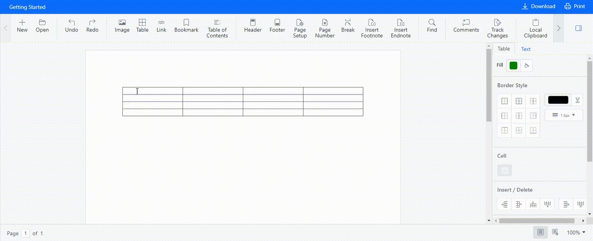

# Working with Table Formatting

Document editor customizes the formatting of table, or table cells such as table width, cell margins, cell spacing, background color, and table alignment. This section describes how to customize these formatting for selected cells, rows, or table in detail.

## Cell margins

You can customize the cell margins by using the following sample code.

```typescript
//To change the left margin
this.$refs.documenteditor.ej2Instances.selection.cellFormat.leftMargin=5.4;
//To change the right margin
this.$refs.documenteditor.ej2Instances.selection.cellFormat.rightMargin=5.4;
//To change the top margin
this.$refs.documenteditor.ej2Instances.selection.cellFormat.topMargin=5.4;
//To change the bottom margin
this.$refs.documenteditor.ej2Instances.selection.cellFormat.bottomMargin=5.4;
```

You can also define the default cell margins for a table. If the specific cell margin value is not defined explicitly in the cell formatting, the corresponding value will be retrieved from default cells margin of the table. Refer to the following sample code.

```typescript
//To change the left margin
this.$refs.documenteditor.ej2Instances.selection.tableFormat.leftMargin=5.4;
//To change the right margin
this.$refs.documenteditor.ej2Instances.selection.tableFormat.rightMargin=5.4;
//To change the top margin
this.$refs.documenteditor.ej2Instances.selection.tableFormat.topMargin=5.4;
//To change the bottom margin
this.$refs.documenteditor.ej2Instances.selection.tableFormat.bottomMargin=5.4;
```

## Background color

You can explicitly set the background color of selected cells using the following sample code.

```typescript
this.$refs.documenteditor.ej2Instances.selection.cellFormat.background='#E0E0E0';
```

Refer to the following sample code to customize the background color of the table.

```typescript
this.$refs.documenteditor.ej2Instances.selection.tableFormat.background='#E0E0E0';
```

## Cell spacing

Refer to the following sample code to customize the spacing between each cell in a table.

```typescript
this.$refs.documenteditor.ej2Instances.selection.tableFormat.cellSpacing=2;
```

## Cell vertical alignment

The content is aligned within a table cell to ‘Top’, ‘Center’, or ‘Bottom’. You can customize this property of selected cells. Refer to the following sample code.

```typescript
this.$refs.documenteditor.ej2Instances.selection.cellFormat.verticalAlignment='Bottom';
```

## Table alignment

The tables are aligned in document editor to ‘Left’, ‘Right’, or ‘Center’. Refer to the following sample code.

```typescript
this.$refs.documenteditor.ej2Instances.selection.tableFormat.tableAlignment=’Center’;
```

## Cell width

Set the desired width of table cells that will be considered when the table is layouted. Refer to the following sample code.

```typescript
this.$refs.documenteditor.ej2Instances.selection.cellFormat.preferredWidthType=’Point’;
this.$refs.documenteditor.ej2Instances.selection.cellFormat.preferredWidth=100;
```

## Table width

You can set the desired width of a table in `Point` or `Percent` type. Refer to the following sample code.

```typescript
this.$refs.documenteditor.ej2Instances.selection.tableFormat.preferredWidthType='Point';
this.$refs.documenteditor.ej2Instances.selection.tableFormat.preferredWidth=300;
```

## Apply borders

Document editor exposes API to customize the borders for table cells by specifying the settings. Refer to the following sample code.

```typescript
import { BorderSettings } from '@syncfusion/ej2-documenteditor';
//To apply border
let borderSettings: BorderSettings = {
            type: 'AllBorders',
            lineWidth: 12
        };
this.$refs.documenteditor.ej2Instances.editor.applyBorders(borderSettings);
```

Please check below gif which illustrates how to apply border for selected cells through properties pane options - border color, line size and no border:



# Working with row formatting

Document editor allows various row formatting such as height and repeat header.

## Row height

You can customize the height of a table row as ‘Auto’, ‘AtLeast’, or ‘Exactly’. Refer to the following sample code.

```typescript
this.$refs.documenteditor.ej2Instances.selection.rowFormat.heightType='Exactly';
this.$refs.documenteditor.ej2Instances.selection.rowFormat.height=20;
```

## Header row

The header row describes the content of a table. A table can optionally have a header row. Only the first row of a table can be the header row. If the cursor position is at first row of the table, then you can define whether it as header row or not, using the following sample code.

```typescript
this.$refs.documenteditor.ej2Instances.selection.rowFormat.isHeader=true;
```

## Allow row break across pages

This property is valid if a table row does not fit in the current page during table layout. It defines whether a table row can be allowed to break. If the value is false, the entire row will be moved to the start of next page. You can modify this property for selected rows using the following sample code.

```typescript
this.$refs.documenteditor.ej2Instances.selection.rowFormat.allowRowBreakAcrossPages=false;
```

## See Also

* [Table properties dialog](../document-editor/dialog#table-properties-dialog/)