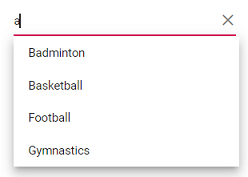

# Getting Started

This section explains how to use Syncfusion Vue AutoComplete components in Vue 3 application.

## Prerequisites

* `vue` : `3+`
* `node` : `10.15+`
* `vue-class-component` : `8.0.0-rc.1`

## Creating Vue application using Vue CLI

The easiest way to create a Vue application is to use the [`Vue CLI`](https://github.com/vuejs/vue-cli). Vue CLI versions above [`4.5.0`](https://v3.vuejs.org/guide/migration/introduction.html#vue-cli) are mandatory for creating applications using Vue 3. Use the following command to uninstall older versions of the Vue CLI.

```bash
npm uninstall vue-cli -g
```

Use the following commands to install the latest version of Vue CLI.

```bash
npm install -g @vue/cli
npm install -g @vue/cli-init
```

Create a new project using the command below.

```bash
vue create quickstart
```

Initiating a new project prompts us to choose the type of project to be used for the current application. Select the option `Default (Vue 3 Preview)` from the menu.


## Adding Syncfusion AutoComplete package in the application

 Syncfusion Vue packages are maintained in the [`npmjs.com`](https://www.npmjs.com/~syncfusionorg) registry.
The AutoComplete component will be used in this example. To install it use the following command.

```bash
npm install @syncfusion/ej2-vue-dropdowns --save
```

## Adding CSS reference for Syncfusion Vue AutoComplete component

Import the needed css styles for the AutoComplete component along with dependency styles in the `<script>` section of the `src/App.vue` file as follows.

```html
<style>
@import "../node_modules/@syncfusion/ej2-base/styles/material.css";
@import "../node_modules/@syncfusion/ej2-inputs/styles/material.css";
@import "../node_modules/@syncfusion/ej2-vue-dropdowns/styles/material.css";
</style>
```

## Adding Syncfusion Vue AutoComplete component in the application

You have completed all the necessary configurations needed for rendering the Syncfusion Vue component. Now, you are going to add the AutoComplete component using following steps.

Import the AutoComplete component in the `<script>` section of the `src/App.vue` file.

```html
<script>
import { AutoCompleteComponent } from "@syncfusion/ej2-vue-dropdowns";
</script>
```

Register the AutoComplete component.

 ```js
import { AutoCompleteComponent } from "@syncfusion/ej2-vue-dropdowns";
//Component registeration
export default {
    name: "App",
    components: {
      'ejs-autocomplete' : AutoCompleteComponent,
    }
}
```

Add the component definition in template section.

```html
<template>
    <div class="control_wrapper">
        <ejs-autocomplete :dataSource='sportsData' :placeholder="waterMark"></ejs-autocomplete>
    </div>
</template>
```

Summarizing the above steps, update the `src/App.vue` file with following code.

```html
<template>
    <div class="control_wrapper">
        <ejs-autocomplete :dataSource='sportsData' :placeholder="waterMark"></ejs-autocomplete>
    </div>
</template>
<script>
import { AutoCompleteComponent } from "@syncfusion/ej2-vue-dropdowns";
//Component registeration
export default {
    name: 'App',
    components: {
        "ejs-autocomplete": AutoCompleteComponent
    },
    data () {
        return {
            waterMark : 'e.g. Basketball',
            sportsData: ['American Football', 'Badminton', 'Basketball', 'Cricket',
                'Football', 'Golf', 'Gymnastics',
                'Hockey', 'Rugby', 'Snooker', 'Tennis'
            ]
        }
    }
}
</script>
```

## Running the application

Run the application using the following command.

```bash
npm run serve
```

## Custom values

The AutoComplete allows the user to give input as custom value which is not required
to present in predefined set of values. By default, this support is enabled by
[`allowCustom`](../api/auto-complete/#allowcustom) property. The custom value will be sent to post back handler when a
form is about to be submitted.

```html
<template>
    <div id="app">
        <ejs-autocomplete :dataSource='sportsData' :placeholder="waterMark" ></ejs-autocomplete>
  </div>
</template>
<script>
import { AutoCompleteComponent } from "@syncfusion/ej2-vue-dropdowns";
//Component registeration
export default {
    name: 'App',
    components: {
        "ejs-autocomplete": AutoCompleteComponent
    },
    data () {
        return {
            waterMark : 'Find a game',
            sportsData: ['Badminton', 'Basketball', 'Cricket',
                'Football', 'Golf', 'Gymnastics',
                'Hockey', 'Rugby', 'Snooker', 'Tennis'
            ]
        }
    }
}
</script>
<style>
@import "../../node_modules/@syncfusion/ej2-base/styles/material.css";
@import "../../node_modules/@syncfusion/ej2-inputs/styles/material.css";
@import "../../node_modules/@syncfusion/ej2-vue-dropdowns/styles/material.css";
  #app {
    color: #008cff;
    height: 40px;
    left: 35%;
    position: absolute;
    top: 35%;
    width: 30%;
  }
</style>
```

## Configure the suggestion list

By default, suggestion list width automatically adjusts according to the AutoComplete
input element's width, and the height of the suggestion list has '300px'.
The height and width of the popup list can also be customized using the [`popupHeight`](../api/auto-complete/#popupheight) and [`popupWidth`](../api/auto-complete/#popupwidth) property respectively.
In the following sample, suggestion list's width and height are configured.

```html
<template>
    <div id="app">
        <ejs-autocomplete :dataSource='sportsData' :popupHeight='height' :popupWidth='width' :placeholder="waterMark" ></ejs-autocomplete>
  </div>
</template>
<script>
import { AutoCompleteComponent } from "@syncfusion/ej2-vue-dropdowns";
//Component registeration
export default {
    name: 'App',
    components: {
        "ejs-autocomplete": AutoCompleteComponent
    },
    data () {
        return {
            waterMark : 'Find a game',
            allowCustom: true,
            height: '250px',
            width: '250px',
            sportsData: ['Badminton', 'Basketball', 'Cricket',
                'Football', 'Golf', 'Gymnastics',
                'Hockey', 'Rugby', 'Snooker', 'Tennis'
            ]
        }
    }
}
</script>
<style>
@import "../../node_modules/@syncfusion/ej2-base/styles/material.css";
@import "../../node_modules/@syncfusion/ej2-inputs/styles/material.css";
@import "../../node_modules/@syncfusion/ej2-vue-dropdowns/styles/material.css";
  #app {
    color: #008cff;
    height: 40px;
    left: 35%;
    position: absolute;
    top: 35%;
    width: 30%;
  }
</style>
```

Output be like the below.



## See Also

* [How to bind the data](./data-binding/)