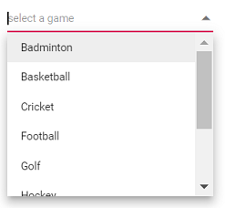

# Getting Started

This section explains how to use Syncfusion Vue ComboBox components in Vue 3 application.

## Prerequisites

* `vue` : `3+`
* `node` : `10.15+`
* `vue-class-component` : `8.0.0-rc.1`

## Creating Vue application using Vue CLI

The easiest way to create a Vue application is to use the [`Vue CLI`](https://github.com/vuejs/vue-cli). Vue CLI versions above [`4.5.0`](https://v3.vuejs.org/guide/migration/introduction.html#vue-cli) are mandatory for creating applications using Vue 3. Use the following command to uninstall older versions of the Vue CLI.

```bash
npm uninstall vue-cli -g
```

Use the following commands to install the latest version of Vue CLI.

```bash
npm install -g @vue/cli
npm install -g @vue/cli-init
```

Create a new project using the command below.

```bash
vue create quickstart
```

Initiating a new project prompts us to choose the type of project to be used for the current application. Select the option `Default (Vue 3 Preview)` from the menu.


## Adding Syncfusion ComboBox package in the application

 Syncfusion Vue packages are maintained in the [`npmjs.com`](https://www.npmjs.com/~syncfusionorg) registry.
The ComboBox component will be used in this example. To install it use the following command.

```bash
npm install @syncfusion/ej2-vue-dropdowns --save
```

## Adding CSS reference for Syncfusion Vue ComboBox component

Import the needed css styles for the ComboBox component along with dependency styles in the `<script>` section of the `src/App.vue` file as follows.

```html
<style>
@import "../node_modules/@syncfusion/ej2-base/styles/material.css";
@import "../node_modules/@syncfusion/ej2-inputs/styles/material.css";
@import "../node_modules/@syncfusion/ej2-vue-dropdowns/styles/material.css";
</style>
```

## Adding Syncfusion Vue ComboBox component in the application

You have completed all the necessary configurations needed for rendering the Syncfusion Vue component. Now, you are going to add the ComboBox component using following steps.

Import the ComboBox component in the `<script>` section of the `src/App.vue` file.

```html
<script>
import { ComboBoxComponent } from "@syncfusion/ej2-vue-dropdowns";
</script>
```

Register the ComboBox component.

 ```js
import { ComboBoxComponent } from "@syncfusion/ej2-vue-dropdowns";
//Component registeration
export default {
    name: "App",
    components: {
        'ejs-combobox' : ComboBoxComponent,
    }
}
```

Add the component definition in template section.

```html
<template>
    <div class="control_wrapper">
        <ejs-combobox id='combobox' :dataSource='sportsData' placeholder='Select a game'></ejs-combobox>
    </div>
</template>
```

Summarizing the above steps, update the `src/App.vue` file with following code.

```html
<template>
    <div class="control_wrapper">
        <ejs-combobox id='combobox' :dataSource='sportsData' placeholder='Select a game'></ejs-combobox>
    </div>
</template>
<script>
import { ComboBoxComponent } from "@syncfusion/ej2-vue-dropdowns";
//Component registeration
export default {
    name: 'App',
    components: {
        "ejs-combobox": ComboBoxComponent
    },
    data () {
        return {
            waterMark : 'e.g. Basketball',
            sportsData: ['Badminton', 'Cricket', 'Football', 'Golf', 'Tennis']
        }
    }
}
</script>
```

## Running the application

Run the application using the following command.

```bash
npm run serve
```

## Custom values

The ComboBox allows the user to give input as custom value which is not required to present in predefined
set of values. By default, this support is enabled by [allowCustom](../api/combo-box/#allowcustom)
property. In this case, both text field and value field considered as same.
The custom value will be sent to post back handler when a form is about to be submitted.

```html
<template>
  <div id="app">
    <div id='container' style="margin:50px auto 0; width:250px;">
        <br>
        <ejs-combobox id='combobox' :dataSource='sportsData' :fields='fields' :allowCustom='allowCustom' placeholder='Select a game'></ejs-combobox>
    </div>
  </div>
</template>
<script>
import { ComboBoxComponent } from "@syncfusion/ej2-vue-dropdowns";
//Component registeration
export default {
    name: 'App',
    components: {
        "ejs-combobox": ComboBoxComponent
    },
    data () {
        return {
            sportsData: [
                { Id: 'game1', Game: 'Badminton' },
                { Id: 'game2', Game: 'Football' },
                { Id: 'game3', Game: 'Tennis' }
            ],
            fields: { text: 'Game', value: 'Id' },
            allowCustom: true
        }
    }
}
</script>
<style>
@import "../../node_modules/@syncfusion/ej2-base/styles/material.css";
@import "../../node_modules/@syncfusion/ej2-inputs/styles/material.css";
@import "../../node_modules/@syncfusion/ej2-vue-dropdowns/styles/material.css";
</style>
```

## Configure the popup list

By default, the width of the popup list automatically adjusts according to the ComboBox input
element's width, and the height of the popup list has '300px'.

The height and width of the popup list can also be customized using the
[popupHeight](../api/combo-box/#popupheight)
&nbsp;and [popupWidth](../api/combo-box/#popupwidth) property
respectively.

In the following sample, popup list's width and height have configured.



```html
<template>
  <div id="app">
    <div id='container' style="margin:50px auto 0; width:250px;">
        <br>
        <ejs-combobox id='combobox' :dataSource='sportsData' popupHeight="200px" popupWidth="250px" placeholder="select a game"></ejs-combobox>
    </div>
  </div>
</template>
<script>
import { ComboBoxComponent } from "@syncfusion/ej2-vue-dropdowns";
//Component registeration
export default {
    name: 'App',
    components: {
        "ejs-combobox": ComboBoxComponent
    },
    data (){
        return {
            sportsData:['Badminton', 'Basketball', 'Cricket', 'Football', 'Golf', 'Hockey', 'Rugby', 'Snooker', 'Tennis']
        }
    }
}
</script>
<style>
@import "../../node_modules/@syncfusion/ej2-base/styles/material.css";
@import "../../node_modules/@syncfusion/ej2-inputs/styles/material.css";
@import "../../node_modules/@syncfusion/ej2-vue-dropdowns/styles/material.css";
</style>
```

Output be like the below.



## See Also

* [How to bind the data](./data-binding/)