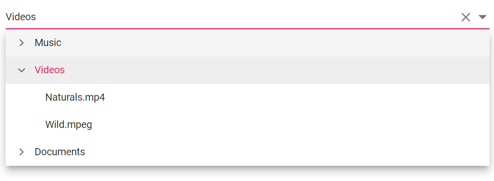

# Getting Started with Syncfusion Dropdown Tree Component in Vue 3

This section explains how to use Dropdown Tree component in Vue 3 application.

## Prerequisites

* `vue` : `3+`
* `node` : `10.15+`
* `vue-class-component` : `8.0.0-rc.1`

## Creating Vue application using Vue CLI

The easiest way to create a Vue application is to use the [`Vue CLI`](https://github.com/vuejs/vue-cli). Vue CLI versions above [`4.5.0`](https://v3.vuejs.org/guide/migration/introduction.html#vue-cli) are mandatory for creating applications using Vue 3. Use the following command to uninstall older versions of the Vue CLI.

```bash
npm uninstall vue-cli -g
```

Use the following commands to install the latest version of Vue CLI.

```bash
npm install -g @vue/cli
npm install -g @vue/cli-init
```

Create a new project using the command below.

```bash
vue create quickstart

```

Initiating a new project prompts us to choose the type of project to be used for the current application. Select the option `Default (Vue 3 Preview)` from the menu.


## Adding Syncfusion Dropdown Tree package in the application

 Syncfusion Vue packages are maintained in the [`npmjs.com`](https://www.npmjs.com/~syncfusionorg) registry.
The Dropdown Tree component will be used in this example. To install it use the following command.

```bash
npm install @syncfusion/ej2-vue-dropdowns --save
```

## Adding CSS reference for Syncfusion Vue Dropdown Tree component

Import the needed CSS styles for the Dropdown Tree component along with dependency styles in the `<style>` section of the `src/App.vue` file as follows.

```html
<style>
@import "../node_modules/@syncfusion/ej2-base/styles/material.css";
@import "../node_modules/@syncfusion/ej2-inputs/styles/material.css";
@import "../node_modules/@syncfusion/ej2-navigations/styles/material.css";
@import "../node_modules/@syncfusion/ej2-vue-dropdowns/styles/material.css";
</style>
```

> Note: Dropdown Tree component use other Syncfusion components too, the dependent component's CSS references need to be added for using all the Dropdown Tree functionalities.

## Adding Syncfusion Vue Dropdown Tree component in the application

You have completed all the necessary configurations needed for rendering the Syncfusion Vue component. Now, you are going to add the Dropdown Tree component using following steps.

  1. Import the Dropdown Tree component in the `<script>` section of the `src/App.vue` file.

     ```html
      <script>
      import { DropDownTreeComponent } from '@syncfusion/ej2-vue-dropdowns';
      </script>  
     ```
  2. Register the Dropdown Tree component in `src/App.vue` file which are used in this example.

     ```js
      import { DropDownTreeComponent } from '@syncfusion/ej2-vue-dropdowns';
      //Component registeration
      export default {
          name: "App",
          components: {
            'ejs-dropdowntree' : DropDownTreeComponent
          }
      }
     ```

     In the above code snippet, you have registered Dropdown Tree component.

  3. Add the component definition in template section.

     ```html
      <template>
          <ejs-dropdowntree id='dropdowntree' :fields='fields'></ejs-dropdowntree>
      </template>  
     ```

     Above is the Dropdown Tree component definition, with `fields` property binding definition.

  4. Declare the bound properties in the `script` section. Declare the collection `data` which is bound for the `fields` property.

     ```js
      var data =  [
      {
          nodeId: '01', nodeText: 'Music',
          nodeChild: [
              { nodeId: '01-01', nodeText: 'Gouttes.mp3' }
          ]
      },
      {
          nodeId: '02', nodeText: 'Videos', expanded: true,
          nodeChild: [
              { nodeId: '02-01', nodeText: 'Naturals.mp4' },
              { nodeId: '02-02', nodeText: 'Wild.mpeg' },
          ]
      },
      {
          nodeId: '03', nodeText: 'Documents',
          nodeChild: [
              { nodeId: '03-01', nodeText: 'Environment Pollution.docx' },
              { nodeId: '03-02', nodeText: 'Global Water, Sanitation, & Hygiene.docx' },
              { nodeId: '03-03', nodeText: 'Global Warming.ppt' },
              { nodeId: '03-04', nodeText: 'Social Network.pdf' },
              { nodeId: '03-05', nodeText: 'Youth Empowerment.pdf' },
          ]
      }];
      export default {
        name: 'App',
        components: {
          'ejs-dropdowntree' : DropDownTreeComponent
        },
        data() {
          return {
            fields: { dataSource: data, value: 'nodeId', text: 'nodeText', child: 'nodeChild' }
          };
        },
      };
     ```
  
  5. Summarizing the above steps, update the `src/App.vue` file with following code.

     ```html
      <template>
        <ejs-dropdowntree id='dropdowntree' :fields='fields'></ejs-dropdowntree>
      </template>
      <script>
      import { DropDownTreeComponent } from '@syncfusion/ej2-vue-dropdowns';

      var data =  [
        {
            nodeId: '01', nodeText: 'Music',
            nodeChild: [
                { nodeId: '01-01', nodeText: 'Gouttes.mp3' }
            ]
        },
        {
            nodeId: '02', nodeText: 'Videos', expanded: true,
            nodeChild: [
                { nodeId: '02-01', nodeText: 'Naturals.mp4' },
                { nodeId: '02-02', nodeText: 'Wild.mpeg' },
            ]
        },
        {
            nodeId: '03', nodeText: 'Documents',
            nodeChild: [
                { nodeId: '03-01', nodeText: 'Environment Pollution.docx' },
                { nodeId: '03-02', nodeText: 'Global Water, Sanitation, & Hygiene.docx' },
                { nodeId: '03-03', nodeText: 'Global Warming.ppt' },
                { nodeId: '03-04', nodeText: 'Social Network.pdf' },
                { nodeId: '03-05', nodeText: 'Youth Empowerment.pdf' },
            ]
        }
      ];
      export default {
        name: 'App',
        components: {
          'ejs-dropdowntree' : DropDownTreeComponent
        },
        data() {
          return {
            fields: { dataSource: data, value: 'nodeId', text: 'nodeText', child: 'nodeChild' }
          };
        },
      };
      </script>
      <style>
        @import "../node_modules/@syncfusion/ej2-base/styles/material.css";
        @import "../node_modules/@syncfusion/ej2-inputs/styles/material.css";
        @import "../node_modules/@syncfusion/ej2-navigations/styles/material.css";
        @import "../node_modules/@syncfusion/ej2-vue-dropdowns/styles/material.css";
      </style>
     ```

## Running the application

Run the application using the following command.

```bash
npm run serve
```

Web server will be initiated, Open the quick start app in the browser at port [`localhost:8080`](http://localhost:8080/).


