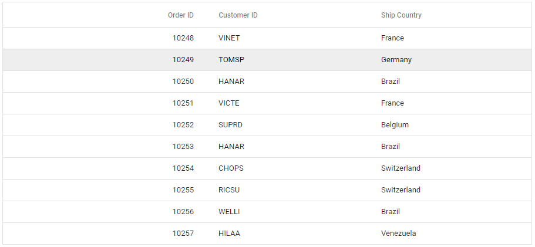

# Overview

This section explains how to use Syncfusion Vue Grid component in Vue 3 application.

## Prerequisites

* `vue` : 3+
* `node` : 10.15+
* `vue-class-component` : 8.0.0-rc.1

## Getting Started with Grid Components and Vue CLI

You can use [`Vue CLI`](https://github.com/vuejs/vue-cli) to setup your Vue applications.
At first it is mostly recommended to uninstall the old Vue CLI package from your system. Vue CLI versions above `4.5.0` are mandatory for creating applications using Vue 3.

```bash
npm uninstall vue-cli -g
```

Then install Vue CLI 3, using the following commands.

```bash
npm install -g @vue/cli
npm install -g @vue/cli-init
```

Start a new project using the following Vue CLI command.

```bash
vue create quickstart

cd quickstart
npm install

```

Initiating a new project prompts us to choose the type of project to be used for the current application. Select the option `Default (Vue 3 Preview)` from the menu.


## Adding Syncfusion packages

Syncfusion Vue packages are maintained in the [`npmjs.com`](https://www.npmjs.com/~syncfusionorg) registry. The Grid component will be used in this example. To install it, use the following command.

```bash
npm install @syncfusion/ej2-vue-grids --save
```

## Adding CSS Reference

Import components CSS as given below in **style** section of the **App.vue** file. Here Material theme is used for this sample.

```html
<style>
@import "../node_modules/@syncfusion/ej2-vue-grids/styles/material.css";
</style>
```

## Adding Grid Component

You have completed all the necessary configurations needed for rendering the Syncfusion Vue Grid component. Now, you are going to add the Grid component using the following steps.

Import the Grid component in the `<script>` section of the `src/App.vue` file.

   ```html
   <script>
   import { GridComponent, ColumnsDirective, ColumnDirective } from '@syncfusion/ej2-vue-grids';
   </script>

   ```

Register the Grid component along with the required child directives which are used in this example.

```js
import { GridComponent, ColumnsDirective, ColumnDirective } from '@syncfusion/ej2-vue-grids';
  //Component registration
export default {
    name: "App",
    components: {
      'ejs-grid' : GridComponent,
      'e-columns' : ColumnsDirective,
      'e-column' : ColumnDirective
    }
}
```

In the above code snippet, you have registered the Grid and column directives. Column directives are used to define the column definition for the Grid component.

Add the component definition in the template section.

```typescript
  <template>
 <ejs-grid :dataSource='data'>
     <e-columns>
         <e-column field='OrderID' headerText='Order ID' textAlign='Right'  width=100></e-column>
         <e-column field='CustomerID' headerText='Customer ID' width=120></e-column>
         <e-column field='ShipCountry' headerText='Ship Country' width=150></e-column>
     </e-columns>
 </ejs-grid>
 </template>

 ```

Define the collection `data` which is bound for the `dataSource` property in the `script` section.

```js
data() {
  return {
    data:  [
      {
         "OrderID":10248,
         "CustomerID":"VINET",
         "ShipCountry":"France"
      },
      {
         "OrderID":10249,
          "CustomerID":"TOMSP",
          "ShipCountry":"Germany"
      },
      .  .  .]
    };
}

```

Inject the required modules in the `provide` section.

```js
provide: {
    grid: [Page]
  }
```

## Running the application

Below is the Summarized view of the Grid component in the `src/App.vue` file.

```html
<template>
  <ejs-grid :dataSource="data">
    <e-columns>
      <e-column field="OrderID" headerText="Order ID" textAlign="Right" width="100"></e-column>
      <e-column field="CustomerID" headerText="Customer ID"  width="80"></e-column>
      <e-column field="ShipCountry" headerText="Ship Country" width="90"></e-column>
    </e-columns>
  </ejs-grid>
</template>
<script>
import { GridComponent, ColumnsDirective, ColumnDirective} from "@syncfusion/ej2-vue-grids";

export default {
  name: "App",
  // Declaring component and its directives
    components: {
      "ejs-grid": GridComponent,
      "e-columns": ColumnsDirective,
      "e-column": ColumnDirective,
    },
  // Bound properties declarations
  data() {
    return {
      data: [
        {
          OrderID: 10248,
          CustomerID: "VINET",
          ShipCountry: "France",
        },
        {
          OrderID: 10249,
          CustomerID: "TOMSP",
          ShipCountry: "Germany",
        },
        .  .  .
      ],
    };
  },
};
</script>

<style>
@import "../node_modules/@syncfusion/ej2-vue-grids/styles/material.css";
</style>
```

Run the application using the following command.

```bash
npm run serve
```

Web server will be initiated. Open the quick start app in the browser at port [`localhost:8080`](http://localhost:8080/).



Refer the following sample, [vue3-grid-getting-started](https://github.com/SyncfusionExamples/EJ2-Vue3-gettingstarted).

For Migrating from Vue 2 to Vue 3 refer the Migration [`docuemntation`](https://ej2.syncfusion.com/vue/documentation/getting-started/vue3-tutorial/#migration-from-vue-2-to-vue-3)
