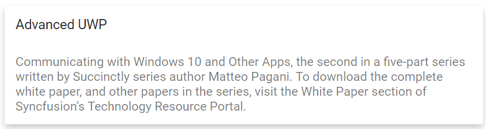

# Getting Started

This section explains how to create a simple **Card** using styles by configuring the structure for the header, content, using Essential JS 2
[quickstart](https://github.com/syncfusion/ej2-quickstart.git) seed repository.

## Prerequisites

* `vue` : `3+`
* `node` : `10.15+`
* `vue-class-component` : `8.0.0-rc.1`

## Creating Vue application using Vue CLI

The easiest way to create a Vue application is to use the [`Vue CLI`](https://github.com/vuejs/vue-cli). Vue CLI versions above [`4.5.0`](https://v3.vuejs.org/guide/migration/introduction.html#vue-cli) are mandatory for creating applications using Vue 3. Use the following command to uninstall older versions of the Vue CLI.

```bash
npm uninstall vue-cli -g
```

Use the following commands to install the latest version of Vue CLI.

```bash
npm install -g @vue/cli
npm install -g @vue/cli-init
```

Create a new project using the command below.

```bash
vue create quickstart
cd quickstart

```

Initiating a new project prompts us to choose the type of project to be used for the current application. Select the option `Default (Vue 3 Preview)` from the menu.


## Adding Syncfusion Card package in application

All the available Essential JS 2 packages are published in [`npmjs.com`](https://www.npmjs.com/~syncfusionorg) registry.
You can choose the component that you want to install. For this application, we are going to use Card component.

To install Card component, use the following command

```bash
npm install @syncfusion/ej2-vue-layouts –save
```

## Adding CSS reference for Syncfusion Vue Card component

Import the needed css styles for the Card component along with dependency styles in the `<style>` section of the `src/App.vue` file as follows.

```html
<style>
@import '../node_modules/@syncfusion/ej2-base/styles/material.css';
@import '../node_modules/@syncfusion/ej2-vue-layouts/styles/material.css';
</style>
```

## Adding a header and content

You can create Card with a header in a specific structure. For adding header you need to create a `div` element with `e-card-header` class added.

* You can include heading inside the Card header by adding a `div` element with `e-card-header-caption` class, and also content will be added
 by adding element with `e-card-content`. For detailed information, refer to the [Header and Content](./header-content/).

```html
    <div class = "e-card">                    --> Root Element
        <div class="e-card-header">           --> Root Header Element
            <div class="e-card-header-caption">    --> Root Heading Element
                <div class="e-card-header-title"></div>   --> Heading Title Element
            </div>
            <div class="e-card-content"></div>         --> Card content Element
        </div>
    </div>
```

## Adding Syncfusion Vue Card component in the application

You have completed all the necessary configurations needed for rendering the Syncfusion Vue component. Add the HTML div element with **e-card** class into the `<template>` section of the `App.vue` file in src directory.

```html
<template>
    <div id='container' style="margin:50px auto 0; width:100%;">
        <br>
          <div tabindex="0" class="e-card" id="basic">
            <div class="e-card-header">
                <div class="e-card-header-caption">
                    <div class="e-card-title">Advanced UWP</div>
                </div>
            </div>
            <div class="e-card-content">
                Communicating with Windows 10 and Other Apps, the second in a five-part series written by Succinctly series
                author Matteo Pagani. To download the complete white paper, and other papers in the series, visit
                the White Paper section of Syncfusion’s Technology Resource Portal.
            </div>
        </div>
    </div>
</template>
<script>
export default {
  name: 'App',
  components: {
  },
  data() {
    return {
    };
  }
}
</script>
<style>
  @import "../node_modules/@syncfusion/ej2-base/styles/material.css";
  @import "../node_modules/@syncfusion/ej2-vue-layouts/styles/material.css";
</style>
```

## Running the Application

Now run the `npm run dev` command in the console, it will build your application.

Run the application using the following command.

```bash

npm run serve

```

Web server will be initiated, Open the quick start app in the browser at port [`localhost:8080`](http://localhost:8080/).


