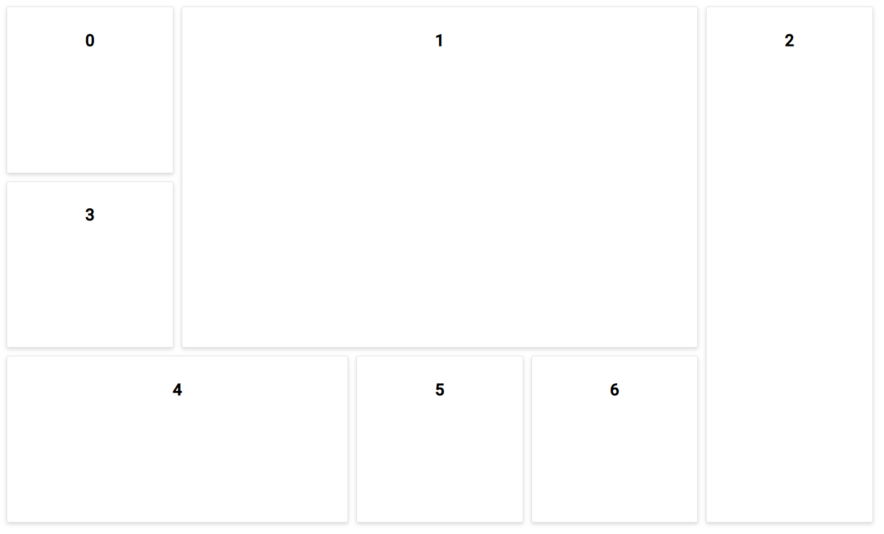

# Getting Started with Syncfusion Dashboard Layout Component in Vue 3

This section explains how to use Dashboard Layout component in Vue 3 application.

## Prerequisites

* `vue` : `3+`
* `node` : `10.15+`
* `vue-class-component` : `8.0.0-rc.1`

## Creating Vue application using Vue CLI

The easiest way to create a Vue application is to use the [`Vue CLI`](https://github.com/vuejs/vue-cli). Vue CLI versions above [`4.5.0`](https://v3.vuejs.org/guide/migration/introduction.html#vue-cli) are mandatory for creating applications using Vue 3. Use the following command to uninstall older versions of the Vue CLI.

```bash
npm uninstall vue-cli -g
```

Use the following commands to install the latest version of Vue CLI.

```bash
npm install -g @vue/cli
npm install -g @vue/cli-init
```

Create a new project using the command below.

```bash
vue create quickstart
cd quickstart
```

Initiating a new project prompts us to choose the type of project to be used for the current application. Select the option `Default (Vue 3 Preview)` from the menu.


## Adding Syncfusion Dashboard Layout package in the application

Syncfusion Vue packages are maintained in the [`npmjs.com`](https://www.npmjs.com/~syncfusionorg) registry.
The Dashboard Layout component will be used in this example. To install it use the following command.

```bash
npm install @syncfusion/ej2-vue-layouts --save
```

## Adding CSS reference for Syncfusion Vue Dashboard Layout component

Import the needed css styles for the  Dashboard Layout component along with dependency styles in the `<script>` section of the `src/App.vue` file as follows.

```js
<script>
import "../node_modules/@syncfusion/ej2-base/styles/material.css";
import "../node_modules/@syncfusion/ej2-vue-layouts/styles/material.css";
</script>
```

## Adding Syncfusion Vue Dashboard Layout component in the application

You have completed all the necessary configurations needed  for rendering the Syncfusion Vue component. Now, you are going to add the Dashboard Layout component using following steps.

1. Import the File Manager component in the `<script>` section of the `src/App.vue` file.

     ```html
     <script>
       import { DashboardLayoutComponent, PanelDirective, PanelsDirective } from "@syncfusion/ej2-vue-layouts";
      </script>
     ```

2. Register the Dashboard Layout component along with the required child directives which are used in this example. Find the list of child directives and the tag names that can be used in the Dashboard Layout component in the following table.
  
    | Directive Name   | Tag Name    |
    |------------------|-------------|
    | `PanelsDirective` | `e-panels` |
    | `PanelDirective`  | `e-panel`  |

      ```js
          import { DashboardLayoutComponent, PanelDirective, PanelsDirective } from "@syncfusion/ej2-vue-layouts";
        //Component registeration
        export default {
            name: "App",
            components: {
              "ejs-dashboardlayout": DashboardLayoutComponent,
              "e-panels":PanelsDirective,
              "e-panel":PanelDirective,
            }
        }
    ```

    In the above code snippet, you have registered Dashboard Layout and the panel directives. Panel directives are used to define the panel definition for the Dashboard Layout component.

3. Add the component definition in template section.

    ```html
    <template>
      <ejs-dashboardlayout id="defaultLayout" :columns="6" :cellSpacing='cellSpacing' :cellAspectRaito='aspectRatio'>
        <e-panels>
          <e-panel :row="0" :col="0" :sizeX="1" :sizeY="1" content="<div class='panel-content'>0</div>"></e-panel>
          <e-panel :row="0" :col="1" :sizeX="3" :sizeY="2" content="<div class='panel-content'>1</div>"></e-panel>
          <e-panel :row="0" :col="4" :sizeX="1" :sizeY="3" content="<div class='panel-content'>2</div>"></e-panel>
          <e-panel :row="1" :col="0" :sizeX="1" :sizeY="1" content="<div class='panel-content'>3</div>"></e-panel>
          <e-panel :row="2" :col="0" :sizeX="2" :sizeY="1" content="<div class='panel-content'>4</div>"></e-panel>
          <e-panel :row="2" :col="2" :sizeX="1" :sizeY="1" content="<div class='panel-content'>5</div>"></e-panel>
          <e-panel :row="2" :col="3" :sizeX="1" :sizeY="1" content="<div class='panel-content'>6</div>"></e-panel>  
        </e-panels>
      </ejs-dashboardlayout>
    </template>

    ```

4. Summarizing the above steps, update the `src/App.vue` file with following code.

    ```html
    <template>
      <ejs-dashboardlayout id="defaultLayout" :columns="6" :cellSpacing='cellSpacing' :cellAspectRaito='aspectRatio'>
        <e-panels>
          <e-panel :row="0" :col="0" :sizeX="1" :sizeY="1" content="<div class='panel-content'>0</div>"></e-panel>
          <e-panel :row="0" :col="1" :sizeX="3" :sizeY="2" content="<div class='panel-content'>1</div>"></e-panel>
          <e-panel :row="0" :col="4" :sizeX="1" :sizeY="3" content="<div class='panel-content'>2</div>"></e-panel>
          <e-panel :row="1" :col="0" :sizeX="1" :sizeY="1" content="<div class='panel-content'>3</div>"></e-panel>
          <e-panel :row="2" :col="0" :sizeX="2" :sizeY="1" content="<div class='panel-content'>4</div>"></e-panel>
          <e-panel :row="2" :col="2" :sizeX="1" :sizeY="1" content="<div class='panel-content'>5</div>"></e-panel>
          <e-panel :row="2" :col="3" :sizeX="1" :sizeY="1" content="<div class='panel-content'>6</div>"></e-panel>  
        </e-panels>
      </ejs-dashboardlayout>
    </template>

    <script>
    import "../node_modules/@syncfusion/ej2-base/styles/material.css";
    import "../node_modules/@syncfusion/ej2-vue-layouts/styles/material.css";
    import { DashboardLayoutComponent, PanelDirective, PanelsDirective } from "@syncfusion/ej2-vue-layouts";

    export default {
        name: "App",
        components: {
          "ejs-dashboardlayout": DashboardLayoutComponent,
          "e-panels":PanelsDirective,
          "e-panel":PanelDirective,
        },
        data() {
          return {
              aspectRatio: 100/85,
              cellSpacing: [10,10],
          }
        }
    }
    </script>
    <style>
    /* DashboardLayout element styles  */
    #defaultLayout .e-panel .e-panel-container {
      vertical-align: middle;
      font-weight: 600;
      font-size: 20px;
      text-align: center;
    }

    .panel-content {
      line-height: 80px;
    }

    #defaultLayout .e-panel {
      transition:none !important;
    }
    </style>

    ```

## Running the application

Run the application using the following command.

```bash
npm run serve
```

Web server will be initiated, Open the quick start app in the browser at port [`localhost:8080`](http://localhost:8080/).


