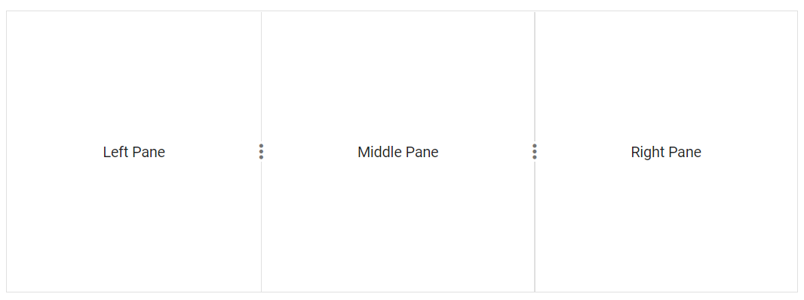

# Getting Started

This section explains how to use Syncfusion Vue Splitter component in Vue 3 application.

## Prerequisites

* `vue` : `3+`
* `node` : `10.15+`
* `vue-class-component` : `8.0.0-rc.1`

## Creating Vue application using Vue CLI

The easiest way to create a Vue application is to use the [`Vue CLI`](https://github.com/vuejs/vue-cli). Vue CLI versions above [`4.5.0`](https://v3.vuejs.org/guide/migration/introduction.html#vue-cli) are mandatory for creating applications using Vue 3. Use the following command to uninstall older versions of the Vue CLI.

```bash
npm uninstall vue-cli -g
```

Use the following commands to install the latest version of Vue CLI.

```bash
npm install -g @vue/cli
npm install -g @vue/cli-init
```

Create a new project using the command below.

```bash
vue create quickstart
cd quickstart

```

Initiating a new project prompts us to choose the type of project to be used for the current application. Select the option `Default (Vue 3 Preview)` from the menu.


## Adding Syncfusion Splitter package in the application

All the available Essential JS 2 packages are published in [`npmjs.com`](https://www.npmjs.com/~syncfusionorg) registry.

Install the `Splitter` component by using the below npm command.

```bash
npm install @syncfusion/ej2-vue-layouts --save
```

## Adding CSS reference for Syncfusion Vue Splitter component

Import the needed css styles for the Splitter component along with dependency styles in the `<style>` section of the `src/App.vue` file as follows.

```html
<style>
@import '../node_modules/@syncfusion/ej2-base/styles/material.css';
@import '../node_modules/@syncfusion/ej2-vue-layouts/styles/material.css';
</style>
```

## Adding Syncfusion Vue Splitter component in the application

You have completed all the necessary configurations needed for rendering the Syncfusion Vue component. Now, you are going to add the Splitter component using following steps.

* Import the Splitter component in the `<script>` section of the `src/App.vue` file.

     ```html
     <script>
        import { SplitterComponent, PanesDirective, PaneDirective } from "@syncfusion/ej2-vue-layouts";
      </script>
     ```

* Register the Splitter component.

```javascript
        import { SplitterComponent, PanesDirective, PaneDirective } from "@syncfusion/ej2-vue-layouts";
        //Component registration
        export default {
            name: "App",
            components: {
                'ejs-splitter' : SplitterComponent,
                'e-panes': PanesDirective,
                'e-pane': PaneDirective
            },
        }
```

* Add the component definition in template section.

```html
<template>
   <ejs-splitter id='default-splitter' height='250px'>
        <e-panes>
            <e-pane content='Left Pane'></e-pane>
            <e-pane content='Middle Pane'></e-pane>
            <e-pane content='Right Pane'></e-pane>
        </e-panes>
    </ejs-splitter>
</template>
```

* Summarizing the above steps, update the `src/App.vue` file with following code.

```html
<template>
   <ejs-splitter id='default-splitter' height='250px'>
        <e-panes>
            <e-pane content='Left Pane'></e-pane>
            <e-pane content='Middle Pane'></e-pane>
            <e-pane content='Right Pane'></e-pane>
        </e-panes>
    </ejs-splitter>
</template>
<script>
import { SplitterComponent, PanesDirective, PaneDirective } from "@syncfusion/ej2-vue-layouts";
export default {
  name: 'App',
  components: {
    'ejs-splitter' : SplitterComponent,
    'e-panes': PanesDirective,
    'e-pane': PaneDirective
  },
  data() {
    return {
    };
  }
}
</script>
<style>
@import '../node_modules/@syncfusion/ej2-base/styles/material.css';
@import '../node_modules/@syncfusion/ej2-vue-layouts/styles/material.css';

#app {
    margin: 60px auto;
    max-width: 700px;
}
.e-splitter {
    margin: 0 auto;
}
.e-pane {
  text-align: center;
  align-items: center;
  display: grid;
}
</style>
```

## Running the application

Run the application using the following command.

```bash

npm run serve

```

Web server will be initiated, Open the quick start app in the browser at port [`localhost:8080`](http://localhost:8080/).


