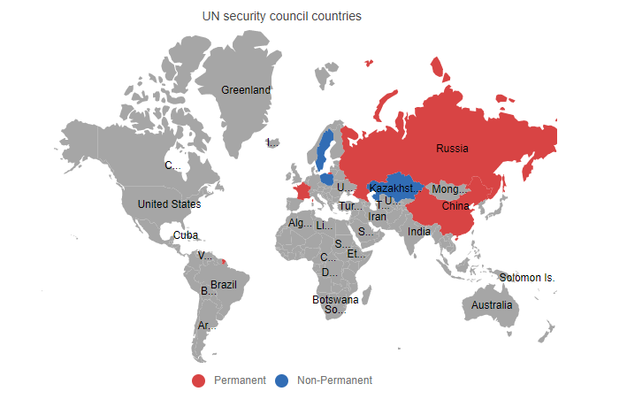

# Getting Started with Syncfusion Maps component in Vue 3

This section explains how to use Maps component in Vue 3 application.

## Prerequisites

* `vue` : `3+`
* `node` : `10.15+`
* `vue-class-component` : `8.0.0-rc.1`

## Creating Vue application using Vue CLI

The easiest way to create a Vue application is to use the [`Vue CLI`](https://github.com/vuejs/vue-cli). Vue CLI versions above [`4.5.0`](https://v3.vuejs.org/guide/migration/introduction.html#vue-cli) are mandatory for creating applications using Vue 3. Use the following command to uninstall older versions of the Vue CLI.

```bash
npm uninstall vue-cli -g

```

Use the following commands to install the latest version of Vue CLI.

```bash
npm install -g @vue/cli
npm install -g @vue/cli-init

```

Create a new project using the command below.

```bash
vue create quickstart

```

Initiating a new project prompts us to choose the type of project to be used for the current application. Select the option `Default (Vue 3 Preview)` from the menu.


## Adding Syncfusion Maps package in the application

Syncfusion Vue packages are maintained in the [`npmjs.com`](https://www.npmjs.com/~syncfusionorg) registry. The Maps component will be used in this example. To install it in the **quickstart** folder use the following command.

```bash
npm install @syncfusion/ej2-vue-maps --save

```

## Adding Syncfusion Maps component in the application

You have completed all the necessary configurations needed for rendering the Syncfusion Vue component. Now, you are going to add the Maps component using following steps.

**1.** Import the Maps component in the `<script>` section of the `src/App.vue` file.

```html
<script>
import { MapsComponent, LayersDirective, LayerDirective, MapAjax, Legend, DataLabel, MapsTooltip } from '@syncfusion/ej2-vue-maps'
</script>

```

**2.** Register the Maps component along with the required child directives which are used in this example. Find the list of child directives and the tag names that can be used in the Maps component in the following table.
  
| Directive Name   | Tag Name    |
|------------------|-------------|
| `LayersDirective` | `e-layers` |
| `LayerDirective`  | `e-layer`  |

```js
import { MapsComponent, LayersDirective, LayerDirective, MapAjax, Legend, DataLabel, MapsTooltip } from '@syncfusion/ej2-vue-maps'
//Component registeration.
export default {
    name: "App",
    components: {
      'ejs-maps' : MapsComponent,
      'e-layers' : LayersDirective,
      'e-layer' : LayerDirective
    }
}

```

In the above code snippet, you have registered Maps and the layer directives. Layer directives are used to define the layer settings for the Maps component. **Legend**, **DataLabel** and **MapsTooltip** modules must be imported as legend, data label and tooltip of the Maps component will be used in this example. The **MapAjax** module is imported to process JSON documents in Maps before they are loaded as shape data.
  
**3.** Add the component definition in template section.

```html
<template>
    <ejs-maps :titleSettings='titleSettings' :legendSettings='legendSettings'>
        <e-layers>
            <e-layer :shapeData='shapeData' :shapePropertyPath='shapePropertyPath' :shapeDataPath='shapeDataPath' :dataSource='dataSource' :shapeSettings='shapeSettings' :dataLabelSettings='dataLabelSettings' :tooltipSettings='tooltipSettings'></e-layer>
        </e-layers>
    </ejs-maps>
</template>

```

Above is the Maps component definition with `titleSettings` and `legendSettings` properties and layer definitions with `dataSource`, `shapeData`, `shapePropertyPath` and so on.

**4.** Declare the bound properties in the `script` section.

```js
  data() {
    return {
      titleSettings: {
          text: 'UN security council countries'
      },
      shapeData: new MapAjax('https://cdn.syncfusion.com/maps/map-data/world-map.json'),
      dataSource: [{  "Country": "China", "Membership": "Permanent"},
            {"Country": "France","Membership": "Permanent" },
            { "Country": "Russia","Membership": "Permanent"},
            {"Country": "Kazakhstan","Membership": "Non-Permanent"},
            { "Country": "Poland","Membership": "Non-Permanent"},
            {"Country": "Sweden","Membership": "Non-Permanent"}],
      shapePropertyPath: 'name',
      shapeDataPath: 'Country',
      shapeSettings: {
            colorValuePath: 'Membership',
            colorMapping: [
                {
                    value: 'Permanent', color: '#D84444'
                },
                {
                    value: 'Non-Permanent', color: '#316DB5'
                }
            ]
      },
      dataLabelSettings: {
            visible: true,
            labelPath: 'name',
            smartLabelMode: 'Trim'
      },
      legendSettings: {
          visible: true
      },
      tooltipSettings: {
          visible: true,
          valuePath: 'Country'
      }
    }
  }

```

**5.** Summarizing the above steps, update the `src/App.vue` file with following code.

```html
<template>
    <ejs-maps :titleSettings='titleSettings' :legendSettings='legendSettings'>
        <e-layers>
            <e-layer :shapeData='shapeData' :shapePropertyPath='shapePropertyPath' :shapeDataPath='shapeDataPath' :dataSource='dataSource' :shapeSettings='shapeSettings' :dataLabelSettings='dataLabelSettings' :tooltipSettings='tooltipSettings'></e-layer>
        </e-layers>
    </ejs-maps>
</template>

<script>
import { MapsComponent, LayersDirective, LayerDirective, MapAjax, Legend, DataLabel, MapsTooltip } from '@syncfusion/ej2-vue-maps'

export default {
  name: 'App',
  components: {
    'ejs-maps': MapsComponent,
    'e-layers': LayersDirective,
    'e-layer': LayerDirective
  },
  data() {
    return {
      titleSettings: {
          text: 'UN security council countries'
      },
      shapeData: new MapAjax('https://cdn.syncfusion.com/maps/map-data/world-map.json'),
      dataSource: [{  "Country": "China", "Membership": "Permanent"},
            {"Country": "France","Membership": "Permanent" },
            { "Country": "Russia","Membership": "Permanent"},
            {"Country": "Kazakhstan","Membership": "Non-Permanent"},
            { "Country": "Poland","Membership": "Non-Permanent"},
            {"Country": "Sweden","Membership": "Non-Permanent"}],
      shapePropertyPath: 'name',
      shapeDataPath: 'Country',
      shapeSettings: {
            colorValuePath: 'Membership',
            colorMapping: [
                {
                    value: 'Permanent', color: '#D84444'
                },
                {
                    value: 'Non-Permanent', color: '#316DB5'
                }
            ]
      },
      dataLabelSettings: {
            visible: true,
            labelPath: 'name',
            smartLabelMode: 'Trim'
      },
      legendSettings: {
          visible: true
      },
      tooltipSettings: {
          visible: true,
          valuePath: 'Country'
      }
    }
  },
  provide: {
    maps: [ Legend, DataLabel ]
  }
}
</script>

```

**6.** Run the application using the following command.

```bash
npm run serve

```

The web server will be initiated and open the **quickstart** app in the browser at port [`localhost:8080`](http://localhost:8080/).



Refer the following sample, [vue3-maps-getting-started](https://github.com/SyncfusionExamples/vue3-maps-getting-started).