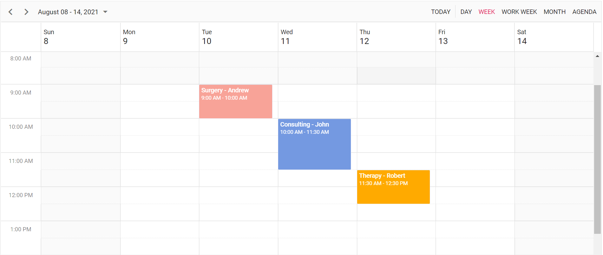

# Getting Started with Syncfusion Schedule Component in Vue 3

This section explains how to use Schedule component in Vue 3 application.

## Prerequisites

* `vue` : `3+`
* `node` : `10.15+`
* `vue-class-component` : `8.0.0-rc.1`

## Creating Vue application using Vue CLI

The easiest way to create a Vue application is to use the [`Vue CLI`](https://github.com/vuejs/vue-cli). Vue CLI versions above [`4.5.0`](https://v3.vuejs.org/guide/migration/introduction.html#vue-cli) are mandatory for creating applications using Vue 3. Use the following command to uninstall older versions of the Vue CLI.

```bash
npm uninstall vue-cli -g
```

Use the following commands to install the latest version of Vue CLI.

```bash
npm install -g @vue/cli
npm install -g @vue/cli-init
```

Create a new project using the command below.

```bash
vue create quickstart
cd quickstart

```

Initiating a new project prompts us to choose the type of project to be used for the current application. Select the option `Default (Vue 3 Preview)` from the menu.


## Adding Syncfusion Schedule package in the application

All the available Essential JS 2 packages are published in [`npmjs.com`](https://www.npmjs.com/~syncfusionorg) registry.

Install the `Scheduler` component by using the below npm command.

```bash
npm install @syncfusion/ej2-vue-schedule --save
```

## Adding CSS reference for Syncfusion Vue Scheduler component

Import the needed css styles for the Scheduler component along with dependency styles in the `<script>` section of the `src/App.vue` file as follows.

```js
<script>
import '../node_modules/@syncfusion/ej2-base/styles/material.css';
import '../node_modules/@syncfusion/ej2-buttons/styles/material.css';
import '../node_modules/@syncfusion/ej2-calendars/styles/material.css';
import '../node_modules/@syncfusion/ej2-dropdowns/styles/material.css';
import '../node_modules/@syncfusion/ej2-inputs/styles/material.css';
import '../node_modules/@syncfusion/ej2-navigations/styles/material.css';
import '../node_modules/@syncfusion/ej2-popups/styles/material.css';
import '../node_modules/@syncfusion/ej2-vue-schedule/styles/material.css';
</script>
```

**Note**: Scheduler component use other Syncfusion components too, the dependent component's CSS references need to be added for using all the Scheduler functionalities.

## Adding Syncfusion Vue Scheduler component in the application

You have completed all the necessary configurations needed for rendering the Syncfusion Vue component. Now, you are going to add the Scheduler component using following steps.

1. Import the Scheduler component in the `<script>` section of the `src/App.vue` file.

     ```html
     <script>
        import { ScheduleComponent, Day, Week, WorkWeek, Month, Agenda, DragAndDrop, Resize, ViewsDirective, ViewDirective, ResourcesDirective, ResourceDirective } from "@syncfusion/ej2-vue-schedule";
      </script>
     ```

2. Register the Scheduler component along with the required child directives which are used in this example. Find the list of child directives and the tag names that can be used in the Scheduler component in the following table.

    | Directive Name   | Tag Name    |
    |------------------|-------------|
    | `ViewsDirective` | `e-views` |
    | `ViewDirective`  | `e-view`  |
    | `ResourcesDirective`  | `e-resources`  |
    | `ResourceDirective`  | `e-resource`  |
    | `HeaderRowsDirective`  | `e-header-rows`  |
    | `HeaderRowDirective`  | `e-header-row`  |

    ```javascript
        import { ScheduleComponent, Day, Week, WorkWeek, Month, Agenda, DragAndDrop, Resize, ViewsDirective, ViewDirective, ResourcesDirective, ResourceDirective } from "@syncfusion/ej2-vue-schedule";
        //Component registeration
        export default {
            name: "App",
            components: {
            'ejs-schedule' : ScheduleComponent,
            'e-views' : ViewsDirective,
            'e-view' : ViewDirective,
            'e-resources' : ResourcesDirective,
            'e-resource' : ResourceDirective
            }
        }
    ```

    In the above code snippet, you have registered Scheduler and its child directives. View directives are used to define the view requirements and Resource directives are used to define the resource definitions for Scheduler. Header row directives are used to customize header rows in Timeline views of scheduler.

3. Add the component definition in template section.

```html

<template>
    <div id='app'>
        <ejs-schedule height='550px' width='100%' :selectedDate='selectedDate' :eventSettings='eventSettings'>
            <e-views>
                <e-view option='Day'></e-view>
                <e-view option='Week' startHour='07:00' endHour='15:00'></e-view>
                <e-view option='WorkWeek' startHour='10:00' endHour='18:00'></e-view>
                <e-view option='Month' showWeekend=false></e-view>
                <e-view option='Agenda'></e-view>
            </e-views>
            <e-resources>
                <e-resource field="OwnerId" title="Owner" name="Owners" :dataSource="ownerDataSource"
                    textField="OwnerText" idField="Id" colorField="OwnerColor">
                </e-resource>
            </e-resources>
        </ejs-schedule>
    </div>
</template>
    ```

4. Declare the bound properties in the `script` section. Declare the collection `data` which is bound for the `dataSource` property.

```js

data() {
  return {
    data:  [
      {
            Id: 1,
            Subject: 'Surgery - Andrew',
            EventType: 'Confirmed',
            StartTime: new Date(2021, 7, 10, 9, 0),
            EndTime: new Date(2021, 7, 10, 10, 0),
            OwnerId: 2
        }, {
            Id: 2,
            Subject: 'Consulting - John',
            EventType: 'Confirmed',
            StartTime: new Date(2021, 7, 11, 10, 0),
            EndTime: new Date(2021, 7, 11, 11, 30),
            OwnerId: 3
        }, {
            Id: 3,
            Subject: 'Therapy - Robert',
            EventType: 'Requested',
            StartTime: new Date(2021, 7, 12, 11, 30),
            EndTime: new Date(2021, 7, 12, 12, 30),
            OwnerId: 1
        },
        ]
    };
}
    ```

5. Summarizing the above steps, update the `src/App.vue` file with following code.

```html

<template>
    <div id='app'>
        <ejs-schedule height='550px' width='100%' :selectedDate='selectedDate' :eventSettings='eventSettings'>
            <e-views>
                <e-view option='Day'></e-view>
                <e-view option='Week' startHour='07:00' endHour='15:00'></e-view>
                <e-view option='WorkWeek' startHour='10:00' endHour='18:00'></e-view>
                <e-view option='Month' showWeekend=false></e-view>
                <e-view option='Agenda'></e-view>
            </e-views>
            <e-resources>
                <e-resource field="OwnerId" title="Owner" name="Owners" :dataSource="ownerDataSource"
                    textField="OwnerText" idField="Id" colorField="OwnerColor">
                </e-resource>
            </e-resources>
        </ejs-schedule>
    </div>
</template>
<script>
import { ScheduleComponent, Day, Week, WorkWeek, Month, Agenda, DragAndDrop, Resize, ViewsDirective, ViewDirective, ResourcesDirective, ResourceDirective } from "@syncfusion/ej2-vue-schedule";
import '../node_modules/@syncfusion/ej2-base/styles/material.css';
import '../node_modules/@syncfusion/ej2-buttons/styles/material.css';
import '../node_modules/@syncfusion/ej2-calendars/styles/material.css';
import '../node_modules/@syncfusion/ej2-dropdowns/styles/material.css';
import '../node_modules/@syncfusion/ej2-inputs/styles/material.css';
import '../node_modules/@syncfusion/ej2-navigations/styles/material.css';
import '../node_modules/@syncfusion/ej2-popups/styles/material.css';
import '../node_modules/@syncfusion/ej2-vue-schedule/styles/material.css';

export default {
    name: "App",
    // Declaring component and its directives
    components: {
        'ejs-schedule': ScheduleComponent,
        'e-views': ViewsDirective,
        'e-view': ViewDirective,
        'e-resources': ResourcesDirective,
        'e-resource': ResourceDirective
    },
    // Bound properties declaration
    data() {
        return {
            selectedDate: new Date(2021, 7, 12),
            allowMultiple: true,
            ownerDataSource: [
                { OwnerText: 'Nancy', Id: 1, OwnerColor: '#ffaa00' },
                { OwnerText: 'Steven', Id: 2, OwnerColor: '#f8a398' },
                { OwnerText: 'Michael', Id: 3, OwnerColor: '#7499e1' }],
            eventSettings: {
                dataSource: [
                    {
                        Id: 1,
                        Subject: 'Surgery - Andrew',
                        EventType: 'Confirmed',
                        StartTime: new Date(2021, 7, 10, 9, 0),
                        EndTime: new Date(2021, 7, 10, 10, 0),
                        OwnerId: 2
                    },
                    {
                        Id: 2,
                        Subject: 'Consulting - John',
                        EventType: 'Confirmed',
                        StartTime: new Date(2021, 7, 11, 10, 0),
                        EndTime: new Date(2021, 7, 11, 11, 30),
                        OwnerId: 3
                    },
                    {
                        Id: 3,
                        Subject: 'Therapy - Robert',
                        EventType: 'Requested',
                        StartTime: new Date(2021, 7, 12, 11, 30),
                        EndTime: new Date(2021, 7, 12, 12, 30),
                        OwnerId: 1
                    }
                ]
            },
        };
    },
      provide: {
      schedule: [Day, Week, WorkWeek, Month, Agenda, DragAndDrop, Resize]
    }
};
</script>

```

## Running the application

Run the application using the following command.

```bash

npm run serve

```

Web server will be initiated, Open the quick start app in the browser at port [`localhost:8080`](http://localhost:8080/).



Refer the sample [Vue 3 scheduler getting started](https://github.com/SyncfusionExamples/vue3-schedule-getting-started)